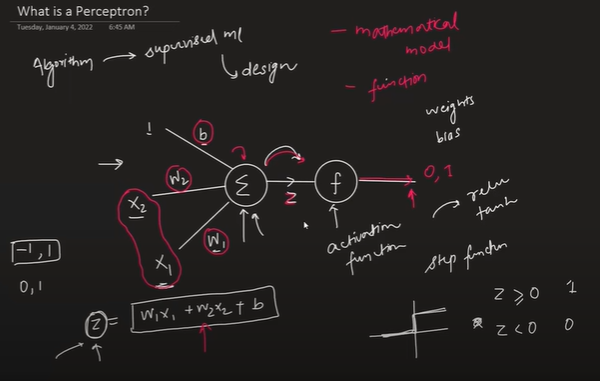
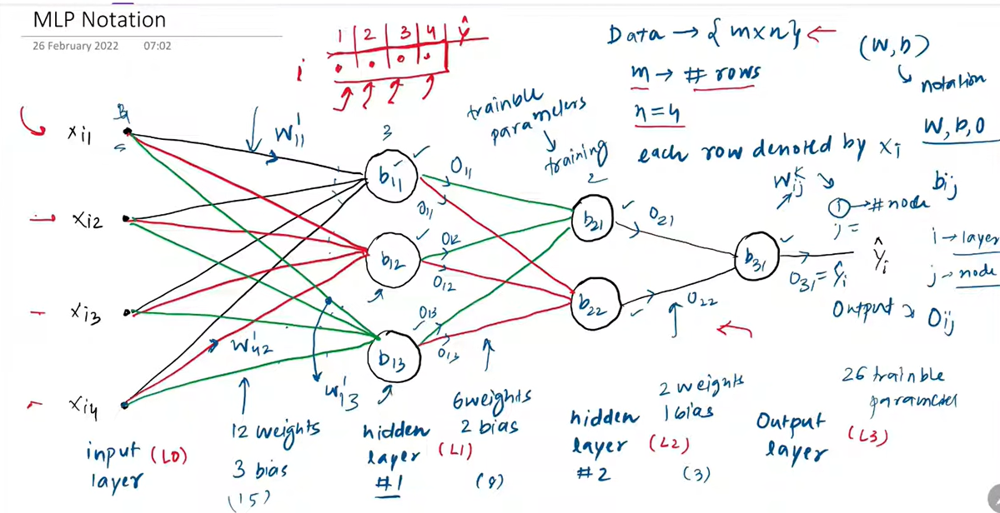

# Perceptron

## Its an algorithm or mathematical model used in supervised ML.
 

## Aspect | Neuron | Perceptron
## Concept | The basic unit in a neural network (inspired by brain neurons) | A specific type of neuron used ## in the earliest neural networks
## Input Handling | Can take multiple inputs, apply weights, activation etc. | Same – takes inputs, applies weights, adds bias
## Activation | Can use modern activations like ReLU, sigmoid, tanh | Uses step function (binary output: 0 or 1)
## Output | Continuous or probabilistic (e.g., 0.8, 0.3, etc.) | Binary: either 0 or 1
## Used In | Modern deep learning models | Simple binary classifiers, foundational ML concept

## f(z) = w1x1 + w2x2 + c

## It can be apply on linear or sort of linear data. It takes inputs, applies weights, adds bias | Uses step function (binary output: 0 or 1) | Simple binary classifiers, foundational ML concept

## To find values of weights and bias. use p = LinearRegression() | p.coef_ to know weights of all features | p.intercept_ to know bias.

# Loss Function:

## A loss function tells us how far off our predictions are from the actual values.

## Loss Function | Activation | output
### log loss (binary cross entropy) | sigmoid | Logistic Regression (binary classification)
### Categorical cross entropy | softmax | multiclass classification (probabilities)
### MSE | linear | linear regression(Number)

# MLP Notation

# Multi Layer Perceptron

