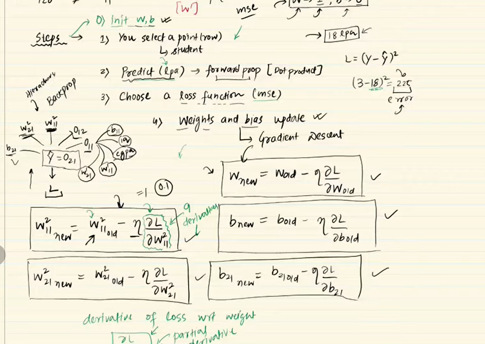

# Back Propogation

## What is Back Propogation?
## Its an algorithm that trains Neural network, where model learns by minimizing error through gradient descent.
## It is the core mechanism by which a neural network updates its weights during training.
## 1. you select the point, 2. predict - forward propogation
## 3. calculate loss using loss function, 4. Weights and Bias update - Gradient Descent

## We will get Average Loss after every epochs.

## Why?
## Loss function is a function of all trainable parameters
## Concept of Gradient:
## Gradient tells you the slope at a given point.
