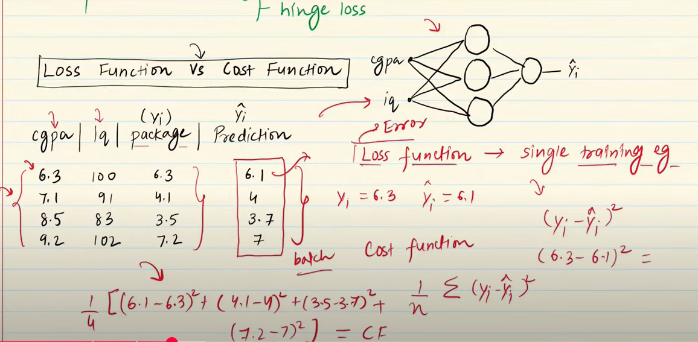
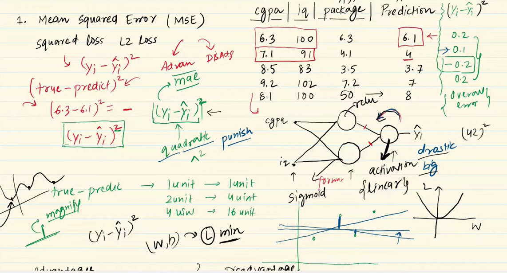
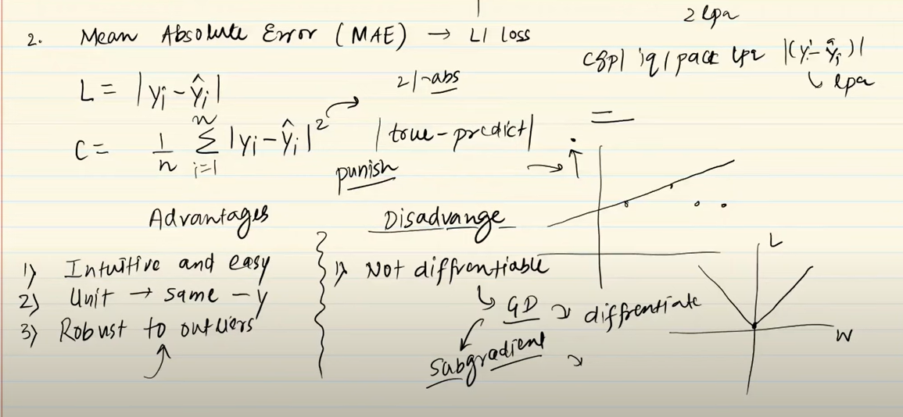
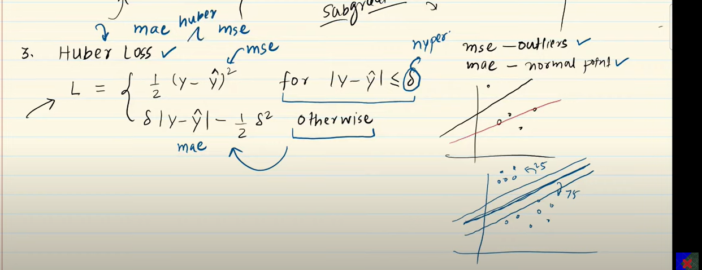
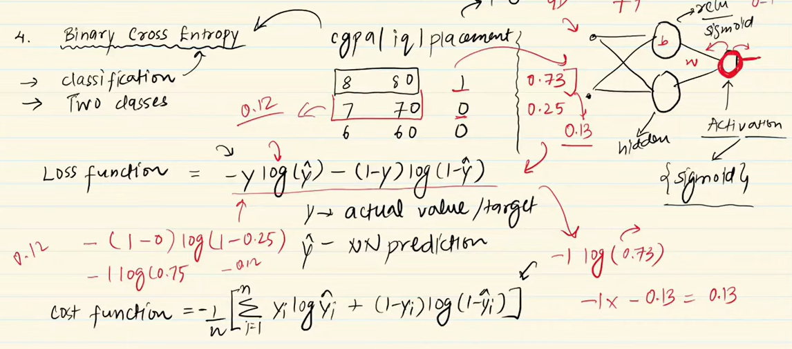
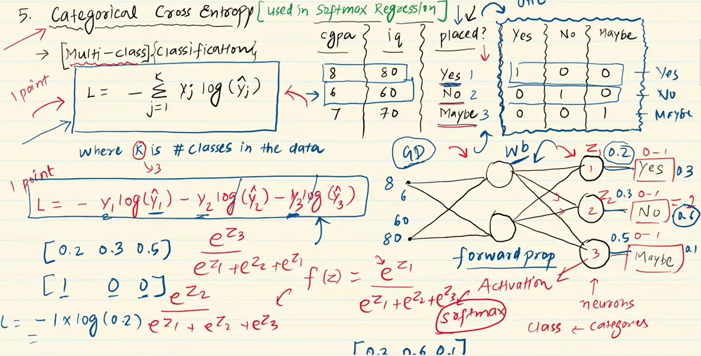

# Loss Function
## It is method of evaluating how well your algorithm is modelling your dataset.
## High Value of loss function  makes model poor. Small Value of loss function  makes model Great.

## We can consider it as a eye of ML algorithm.

# Types of loss function in DL
## Regression: MSE, MAE, Huber loss
## Classification: binary cross entropy, categorical cross entropy, hinge loss
## Autoencoders: KL divergence
## GAN: Discriminator loss, MinMax GAN loss
## Object Detection: focal loss
## Embedding: Tripled Loss

## Loss Function vs Cost Function
## Loss function will calculate on single outcome of dataset.(y_test - y_pred)
## Cost function will calculate on batch of outcome of dataset (y_test - y_pred)/No. of rows

## 1. Mean Squared Loss(MSE) OR Squared loss or L2 Loss
## ## If we don't have ouliers in data use it

## Formula: (yi - y_pred)2 and CF(cost function) = 1/n Sum((yi - y_pred)2)
## Advantages: Easy to interpret, Differentiable, 1 local minima
## Disadvantages: Error unit(squared) , Robust to outliers

## Mean Absolute Error or L1 Loss
## If we have ouliers in data use it

## Formula: 1/n (yi - y_pred)2
## Advantages: Intuitive and Easy to interpret, same unit,Robust to outliers
## Disadvantages: Not Differentiable , Robust to outliers

## Huber Loss
## If our dataset having outlier then it will use MAE and if we don't have it will use MSE.
 

## Binary cross entropy or LogLoss
## It can be used for two classes classification problem
## Advantages: Differentiable
## Disadvantages: Multi local minima, Intuitive

## categorical cross entropy or sparse categorical cross entropy
## For multi-class classificaion problem. (used in softmax regression) ctivation='softmax'
## Sparse categorical cross entropy will encode into int instead of One hot encoding

