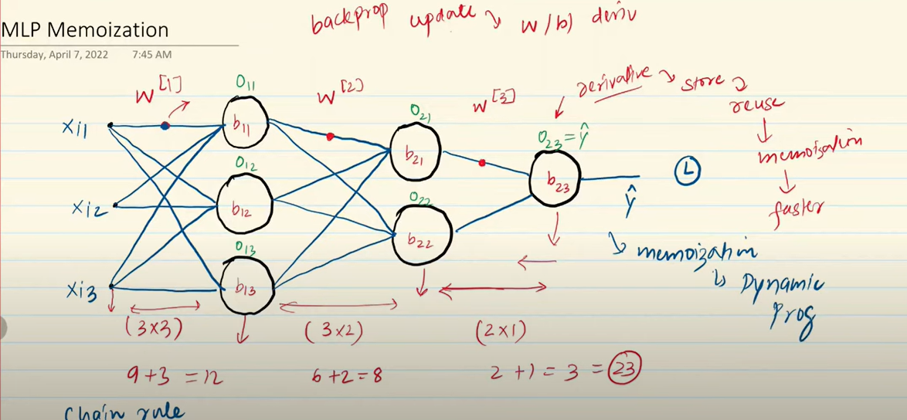

## Memoization: 
## Memoization is an optimization technique used to speed up recursive or repeated computations by caching previously computed results.
## Store results of expensive function calls and return the cached result when the same inputs occur again.

## Where It's Commonly Used: 

## Dynamic programming problems
## Recursive algorithms
## API response caching
## Computationally expensive functions

## Backpropogation based on Chain Rule and Memoization to make it less redundant and faster.

