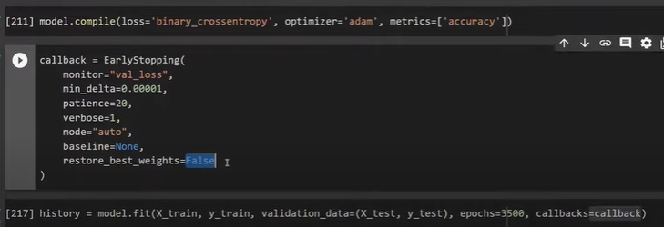

# Early Stopping

## Early stopping is a regularization technique used in deep learning (DL) to prevent overfitting during training.

## Early stopping monitors the validation loss (or accuracy) and stops training when it fails to improve for a specified number of epochs.
### Prevents overfitting.
### Saves training time and computational resources.
### Helps in selecting the best model checkpoint.

from tensorflow.keras.callbacks import EarlyStopping

early_stop = EarlyStopping(
    monitor='val_loss',      # Metric to monitor
    verbose=1,               # To saw the epoch number where early stopping happened
    patience=3,              # Wait for 3 epochs without improvement
    restore_best_weights=True  # Restore model from best epoch
)

model.fit(X_train, y_train, 
          validation_data=(X_val, y_val), 
          epochs=100, 
          callbacks=[early_stop])

