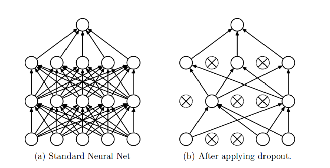

# To avoid Overfitting:
## 1. Add more data
## 2. Reduce Complexity
## 3. Early stopping
## 4. Regularization Techniques
## 5. Droput

# Dropout:
## Randomly will switch off some of Input layer nodes and hidden layer nodes. i.e. weights and bias will get removed for those nodes.

## While Training only will apply Dropout, won't apply for Testing.

## p = Dropout ration (0.2 means 20% nodes will switch off for that layer)If we got overfitting increase p. If Underfitting decrease p. 

## For CNN 40 to 50%
## For RNN 20 to 30%
## For ANN 10 to 50%

# Drawbacks of Droput:
## 1. Delay in Convergence.(Training will be slow)
## 2. Loss function value changes.