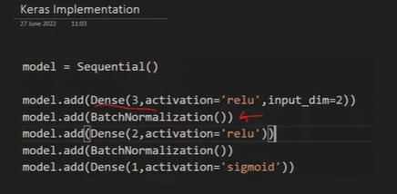

# Batch Normalization (BN) 
## It is a technique used to normalize the inputs of each layer so that they have a mean of 0 and variance of 1, computed within each mini-batch during training.

## It makes the training of Deep Neural Network faster and more stable.
🎯 Why Use Batch Normalization?
Stabilizes training by reducing internal covariate shift.
Allows use of higher learning rates.
Acts as a regularizer (can reduce need for dropout).
Improves convergence speed.
Reduces sensitivity to weight initialization.

⚙️ How It Works
x to a layer, for a mini-batch:
Compute batch statistics:
Normalize:
Scale and shift:

β are learnable parameters.
ϵ is a small constant for numerical stability.

Model Type | Use BN?
Deep MLP | ✅ Yes
CNNs | ✅ Yes
RNNs/LSTMs | ⚠️ Use with care (LayerNorm is better)
Small models | Optional

Training vs Inference
During training: statistics are computed per mini-batch.

During inference: running average of mean/variance (tracked during training) is used.

Pros | Notes
Faster convergence | Use with larger batch sizes
Reduced dependence on init | Placed before activation
Acts like regularization | May reduce need for dropout

