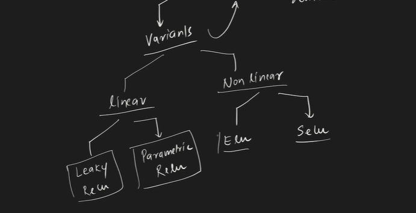

## Activation Function
### An activation function introduces non-linearity into a neural network, allowing it to learn complex patterns beyond just linear combinations.

## Why is it Needed?
### Without activation functions, the entire neural network behaves like a linear function, no matter how many layers you add.

### Activation functions allow neural networks to approximate non-linear mappings, which is critical for tasks like image recognition, NLP, etc.

## Name | Formula | Range | Use Case
### ReLU | f(x)=max⁡(0,x) | (0,∞) | Most popular for hidden layers
### Sigmoid | f(x)=1+e−x1​ | (0,1) | Binary classification (output layer)
### Tanh | f(x)=tanh(x) | (−1,1) | Better than sigmoid for hidden layers
### Leaky ReLU | f(x)=max(0.01x,x) | (−∞,∞) | Avoids dying ReLU problem
### Softmax | f(xi​)=∑j​exj​exi​​ | (0,1), sums to 1 | Multi-class classification (output layer)

## Layer Type | Recommended Activation
### Hidden Layer | ReLU / Leaky ReLU
### Output (Binary) | Sigmoid
### Output (Multi-class) | Softmax
### Output (Regression) | None / Linear

