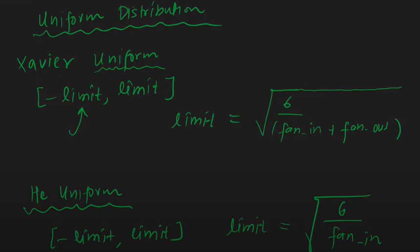
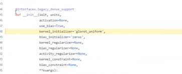
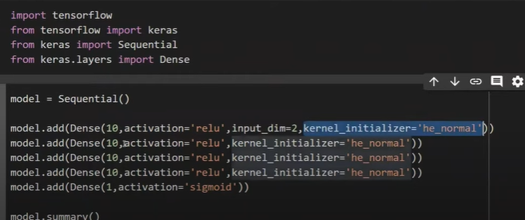

# Weight Initialization

## 1. Initializes the parameter
## 2. Choose an optimized algorithm
## 3. Repeat below steps:
### a. Forward propogate the input.
### b. Compute the cost function
### c. compute gradients of cost with respect to parameters using backpropogation.
### d. update each parameter using gradients, according to optimization algorithm.

## Weight initialization refers to how the initial values of the neural network's weights are set before training starts.

## Proper weight initialization is crucial because:
### It affects convergence speed.
### It can prevent vanishing/exploding gradients.
### It impacts how well the model learns in early epochs.

## ❌ How Not to Initialize Weights
### 1. All Zeros (or All Same Values):
#### Problem: Every neuron in the same layer learns the same features.
#### Reason: With same starting weights, all neurons receive identical gradients ⇒ no diversity in learning ⇒ symmetry problem.

### 2. Too Large Values:
#### Problem: Leads to exploding gradients (especially in deep networks).
#### Reason: Activations and gradients grow exponentially.

## 3. Too Small Values:
#### Problem: Leads to vanishing gradients.
#### Reason: Gradients become too small to update weights meaningfully, especially with sigmoid/tanh.

## By 2 and 3 due to Saturation Training will become slow. Vanishing gradient Problem in case of tanh and sigmoid.

## ✅ How to Initialize Properly

### Initialization | Formula (Weight ∼ Distribution) | Recommended For
### Xavier/Glorot | N(0,1/nin+nout) | Sigmoid / Tanh
### He (Kaiming) | N(0,2/nin) | ReLU / Leaky ReLU
### Uniform Variants | Use same formula with uniform distribution | Lightweight variants

