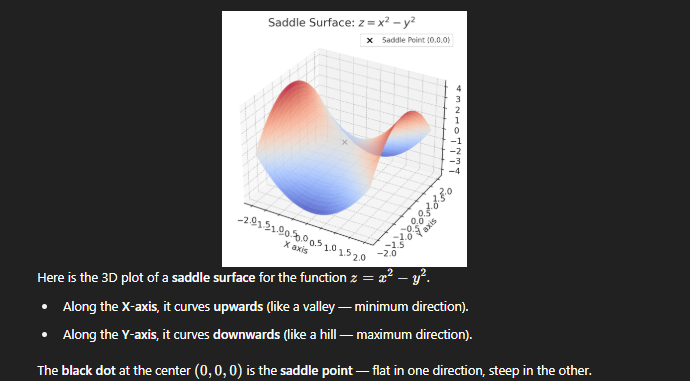

# Optimizers

## An optimizer is an algorithm used to update the weights of a neural network to minimize the loss function during training.

## Optimizer = How the model learns better over time.

## 🎯 What Optimizers Do
### At each training step:
### Compute gradients (how much each weight affects the loss).
### Adjust weights in the opposite direction of the gradient.
### Aim to reduce the loss and improve model predictions.

## Optimizer | Key Idea | Pros | Cons
### SGD (Stochastic Gradient Descent) | Basic gradient descent, step-by-step updates | Simple, effective for small models | Slow convergence, sensitive to learning rate
### Momentum | Adds "memory" to SGD (accelerates updates) | Faster than pure SGD | Needs tuning momentum term
### RMSProp | Scales learning rate adaptively per weight | Good for RNNs, faster convergence | May still need learning rate tuning
### Adam | Combines Momentum + RMSProp | Fast, widely used, adaptive | Slightly more memory usage
### Adagrad | Adapts learning rate, large updates for infrequent features | Good for sparse data (e.g., NLP) | Learning rate shrinks too much sometimes

## 📐 How Optimizer Updates Work (General Formula)
### Simple Gradient Descent:
### 𝑤=𝑤−𝛼⋅∂𝐿/∂𝑤
### Where:
### w = weight
### α = learning rate
### ∂𝐿/∂𝑤= gradient of loss w.r.t weight

### Optimizers like Adam modify this basic idea to make learning faster and more stable.

## Optimizer	Problem
### SGD	Very slow convergence. Needs careful learning rate tuning.
### Momentum	Helps speed up, but still needs fixed learning rate tuning.
### RMSProp	Adaptive learning rates but no momentum to stabilize updates.

## Problems with Previous Optimizers:
### If i have 3 weights and bias, i can't have 3 different learning rates.
### Local minima: Your model might get stuck in a "good enough" place but not the best place for minimizing loss. Saddle points are actually bigger problems than local minima in high-dimensional spaces.
### Local minima are small valleys in the loss surface where optimization could get stuck, but modern techniques (like Adam, random restarts, etc.) largely solve this problem in deep learning.

### Saddle point: It is a point on the loss surface where The gradient is zero (i.e.,∇L(θ)=0), But it is neither a local minimum nor a maximum. It is like a mountain pass: Downward in some directions, Upward in others.

### A saddle point is a "flat and tricky" area where optimization gets slow or stuck.
### Modern optimizers like Adam are specifically designed to escape saddle points and continue improving the model.

## EWMA is a technique used to smooth time series data by giving more weight to recent observations while not completely ignoring past data.
## Why: In many real-world datasets (stock prices, sensor readings, training gradients), the data: Is noisy (random ups and downs), Has sudden spikes, Makes it hard to see true trends.
## Need: A method that reacts faster to recent changes, but still keeps historical stability. EWMA was needed because traditional moving averages were too slow or too unstable. It gives a fast yet smooth view of trends, especially important when recent data changes matter (e.g., in finance, control systems, deep learning).