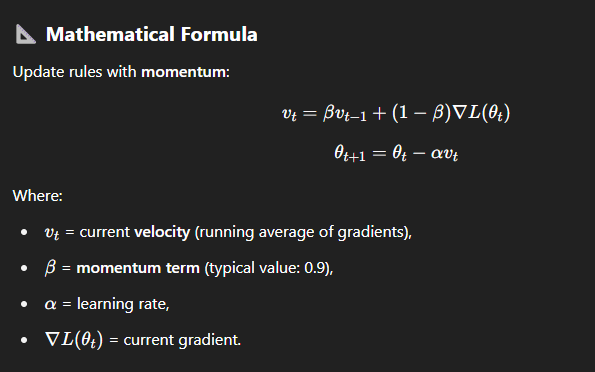
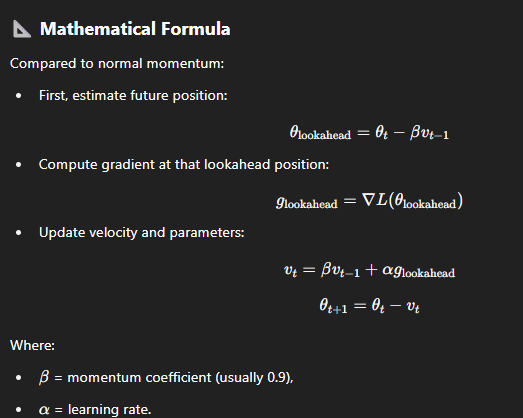
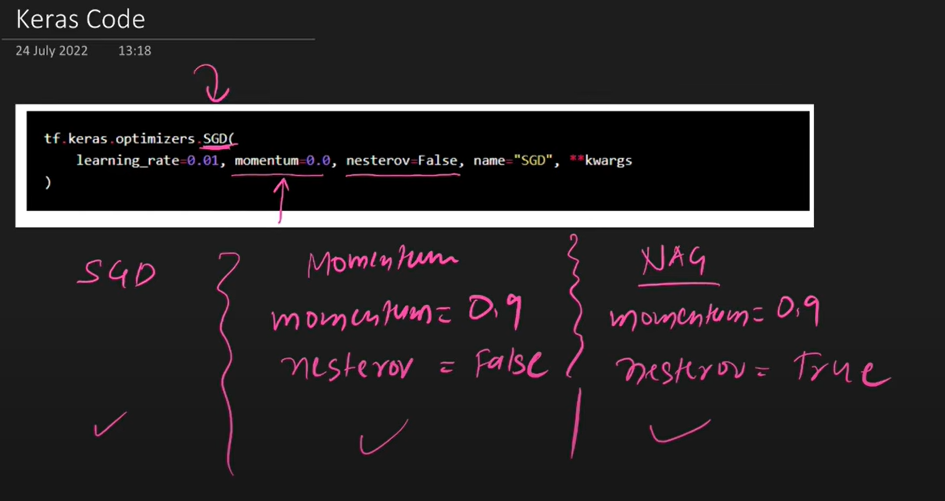
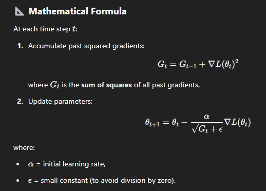
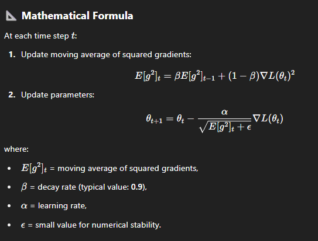
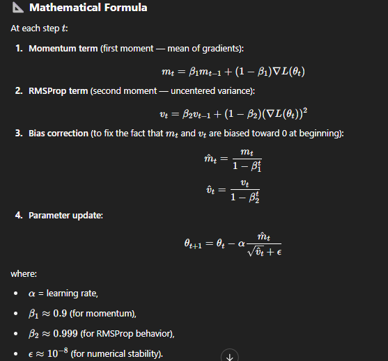

# SGD + Momentum:
## Problem with basic SGD:
### Basic Stochastic Gradient Descent (SGD) updates weights by moving directly opposite to the gradient.
### It can be very slow if the surface is noisy, or different curvatures in different directions.
### It often oscillates and struggles to move efficiently toward the minimum.

## Momentum helps accelerate SGD by remembering the previous updates and moving in a smoother, faster path toward the minimum.

## β≈0.9 → Means 90% importance to the previous velocity, 10% to the new gradient.
## When gradients are consistent, the velocity builds up, leading to faster movement.
## If gradients change direction, momentum helps smooth out oscillations.

## SGD+Momentum improves basic SGD by adding a "memory" of past gradients, which leads to faster convergence and smoother paths.

## Limitations: 1. Fixed Learning Rate, 2. Choosing the right combination of α (learning rate) and β (momentum) requires experimentation. 3. SGD+Momentum does not handle sparse updates efficiently → Slower learning in these cases. 4. No personalized learning rate per parameter like Adam or RMSProp.

# NAG: Nesterov Accelerated Gradient:
## NAG (Nesterov Accelerated Gradient) improves momentum by looking ahead —
## It computes the gradient at the future estimated position instead of the current one.
## In normal momentum, you first compute the gradient at the current position, then move.
## But in complex surfaces, this can cause overshooting because you are moving "blindly" based on the current point.

## NAG improves SGD+Momentum by anticipating future gradients,
## leading to faster convergence and less oscillation, especially in curves and ravines.

# AdaGrad: Adaptive Gradient Algorithm
### In basic SGD or SGD+Momentum:
### Same learning rate: α is applied to all parameters throughout training.
### This is bad because: Rare features (like unusual words in NLP) need bigger updates.
### Frequent features (common words) should have smaller updates over time.

## AdaGrad adjusts the learning rate individually for each parameter based on its past gradients.
## Parameters with large past gradients → Smaller learning rate.
## Parameters with small past gradients → Larger learning rate.
## Thus, each parameter gets its own learning rate that automatically shrinks over time.

## Main Problem with AdaGrad
### Learning rates shrink too much over time.
### Eventually, the learning rate becomes too small, causing training to almost stop.
## (Later optimizers like RMSProp and Adam fixed this.)

# RMSProp: Root Mean Square Propagation
## RMSProp fixes AdaGrad by not accumulating all past gradients forever.
## Instead, it uses a moving average of recent squared gradients.

## Concept	| RMSProp’s Behavior
## Recent gradients	| More important
## Very old gradients | Slowly forgotten
## Learning rate | adaptation	Based on recent history only
## Convergence speed | Faster than AdaGrad

## RMSProp = AdaGrad + moving average of squared gradients
## ➔ Result: Faster, smoother learning without the problem of shrinking learning rates.

# Adam: Adaptive moment Estimation
## Both Momentum and RMSProp solved important problems individually:
## Momentum → Helps accelerate in right direction (uses running average of gradients).
## RMSProp → Helps adapt learning rates (uses running average of squared gradients).
## Adam smartly combines both ideas into one optimizer:

# ➔ Momentum + RMSProp together = Adam

## Thus, Adam provides:
## Smoother direction (thanks to Momentum),
## Adaptive learning rates (thanks to RMSProp),
## Faster and more stable convergence.

## Adam = Momentum + RMSProp + Bias Correction. It brings the best of both worlds: speed, adaptivity, and stability.

# AdamW :
## AdamW = Adam with weight decay decoupled from the gradient update
## ➔ Correct regularization + Better generalization.
## When applying L2 regularization (weight decay) with Adam, it was incorrectly coupled inside the adaptive gradient update.
## This caused incorrect regularization behavior, especially in large models like Transformers.

## Problem in Adam | Solution in AdamW
## Weight decay mixed into gradient | Weight decay applied separately
## Wrong regularization | Proper L2 regularization
## Slower convergence sometimes | Faster and cleaner convergence

# Where AdamW is Used
## Transformers (e.g., BERT, GPT models)
## Vision Transformers (ViT)
## Any large-scale modern deep learning model.