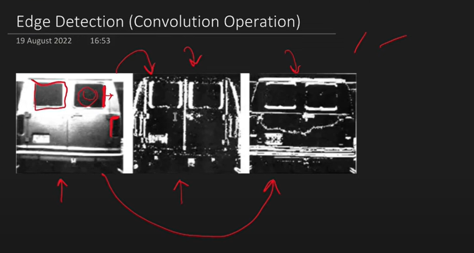
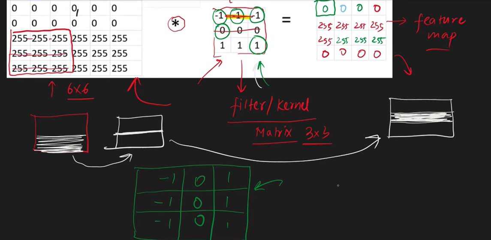

# CNN (Convolutional Neural Network)

## 🔍 What is a CNN?
### A Convolutional Neural Network (CNN) is a type of deep learning model primarily used for image and spatial data processing. It automatically and adaptively learns spatial hierarchies of features through backpropagation, using building blocks like convolution layers, pooling layers, and fully connected layers.

## 🎯 Why use CNNs?
### Traditional neural networks (like fully connected networks) don't scale well to image data due to:
### 1. High dimensionality: An image of size 224×224×3 has 150,528 inputs.
### 2. Lack of spatial understanding: FCNs treat each pixel independently, losing spatial structure.
### 3. Overfitting risk: Too many parameters make them prone to overfitting and slow to train.

## CNNs solve this by:
### Local connectivity (convolutional filters), Parameter sharing, and Translation invariance via pooling.
### Hence, CNNs are ideal for image classification, object detection, segmentation, and even NLP tasks involving spatial hierarchies.

## ⚙️ How CNNs Work (Simplified)
### A CNN typically consists of the following layers:
### Convolution Layer
#### Applies filters (kernels) to input images to extract features like edges, corners, etc.
#### Each filter slides (convolves) across the image producing a feature map.
### Activation Layer (ReLU)
#### Applies non-linearity so the network can learn complex patterns.
### Pooling Layer (Max/Avg Pooling)
#### Reduces the spatial size (downsampling), retaining essential features and reducing computation.
### Fully Connected Layer (Dense)
#### Flattens the 2D features into a 1D vector and classifies the input into categories.
### Output Layer
#### Gives the final prediction (e.g., probabilities in image classification).

## We will worked on grey scale and RGB image.
### Gray scale image has ony 1 channel like 28*28 0-255 range 0 means black 1 means white after normalization.
### Colour Image has 3 channels Red, Green, Blue so, 228*228*3.

## Edges are changes in intensity.

### vertical and Horizontal Edges Detection.