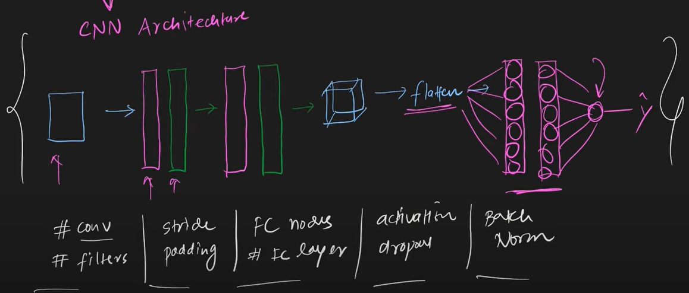
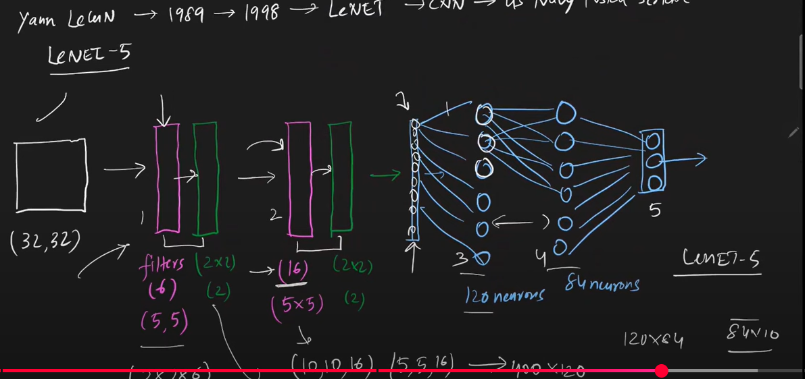

# ✅ LeNet-5 Architecture – Simple Summary for Interviews
### Developed by Yann LeCun for digit recognition (MNIST).
### Input: 32×32 grayscale image.
### C1 – Convolution Layer
### 6 filters, 5×5 size → Output: 28×28×6
### Activation: tanh

### S2 – Average Pooling
### 2×2 pooling → Output: 14×14×6
### Reduces size, keeps features.

### C3 – Convolution Layer
### 16 filters, 5×5 → Output: 10×10×16
### Activation: tanh

### S4 – Average Pooling
### 2×2 pooling → Output: 5×5×16

### C5 – Convolution (Fully Connected)
### 120 filters, 5×5 (covering full input) → Output: 1×1×120

### Flattened to vector of size 120
### Activation: tanh

### F6 – Fully Connected Layer
### 84 neurons
### Activation: tanh

### Output Layer
### 10 neurons (for 10 classes)
### Activation: softmax