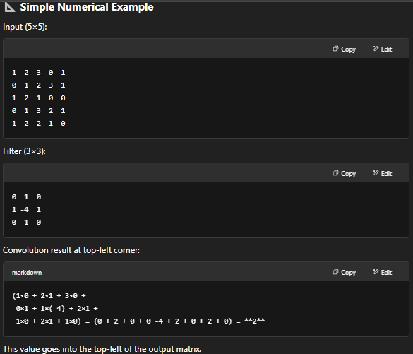

# Convolutional Operation, Padding, Strides, Pooling layer.

## The convolutional operation is the core of CNNs. It helps extract meaningful features (edges, textures, patterns) from input data like images.

## 📦 What is a Convolutional Operation?
### It is a mathematical operation that slides a small matrix (called a filter or kernel) over the input data (e.g., an image) and computes dot products between the filter and local regions of the input.

## 🧠 Why Do We Use It?
### To detect local patterns (e.g., vertical edges, curves).
### To reduce the number of parameters compared to fully connected layers.
### To preserve spatial relationships in the data (important in images).

## 📊 Key Hyperparameters
### Kernel size (e.g., 3×3, 5×5)
### Stride (how far the filter moves each time)
### Padding (adding zeros around the border to preserve size)
### Number of filters (each learns a different feature)

# Padding
## 🧱 1. Padding
### Definition: Padding is the process of adding extra pixels (usually zeros) around the border of the input image.

## ✅ Why Padding is Used:
### To preserve the spatial dimensions (height & width) of the input.
### To allow the filter to reach edge pixels.
### To control the size of the output.

## 📌 Types of Padding:
### 1. Valid Padding (No Padding):
### Output is smaller than input.
### Formula: Output size=⌊(𝑁−𝐹)/𝑆+1⌋
#### where:
#### N = input size
#### F = filter size
#### S = stride

### 2.Same Padding (Zero Padding):
### Padding is added so that output size = input size.
### Padding 𝑃 is chosen as:
### 𝑃=⌊𝐹−1/2⌋

# Strides
## Definition: Stride is the number of pixels the filter moves (or "strides") over the input.

## ✅ Why Stride is Used:
### To control the resolution of the output feature map.
### Larger strides → smaller output, faster computation, less detail.
### Stride of 1 → Filter moves one pixel at a time (high resolution).
### Stride of 2 or more → Skips pixels, producing a downsampled output.

## 📊 Example:
### Input size: 5×5
### Filter size: 3×3
### Padding: 0
### Stride: 1 → Output = 3×3
### Stride: 2 → Output = 2×2 (fewer values, coarser output)

## 📐 Output Size Formula
### If you want to calculate output size after convolution:

### Output size=⌊(𝑁+2𝑃−𝐹)/𝑆+1⌋
#### Where:
#### N = input size
#### P = padding
#### F = filter size
#### S = stride

#### | Term    | Purpose                            | Effect                     |
#### |---------|------------------------------------|----------------------------|
#### | Padding | Preserve size, handle borders      | Adds border pixels (zeros) |
#### | Stride  | Control movement of the filter     | Affects output resolution  |

# Pooling Layer
## The pooling layer is a key component in Convolutional Neural Networks (CNNs). It reduces the spatial size (height × width) of feature maps while retaining the most important features.

## 🔍 What is a Pooling Layer?
### A pooling layer downsamples the input feature map by summarizing regions, usually through:
### Max pooling: Takes the maximum value from the region.
### Average pooling: Takes the average value from the region.
### Pooling is typically applied after convolution + ReLU.

## 🎯 Why Use Pooling?
### Pooling helps by:
### ✅ Reducing computation (fewer parameters).
### ✅ Controlling overfitting (less complexity).
### ✅ Achieving spatial invariance (recognizes features regardless of small shifts or distortions).

## ⚙️ How Does Pooling Work?
### The most common types of pooling:
## 1. Max Pooling
#### Takes the maximum value in each window (e.g., 2×2 area).
#### → Retains the most prominent feature.
## 2. Average Pooling
#### Takes the average of all values in the window.
#### → Smooths the feature map, less aggressive than max pooling.

## 🧠 Key Parameters
### Pool size: Usually 2×2 or 3×3
### Stride: Typically 2 (non-overlapping)
### Padding: Usually 0 (no padding)

### | Pooling Type | Operation | Output |
### |--------------|-----------|--------|
### | Max Pooling  | Keeps max value in each window | Sharpest |
### | Avg Pooling  | Averages values in each window | Smoother |
### | Global Pooling | Pools over entire map (1 value) | For classification |