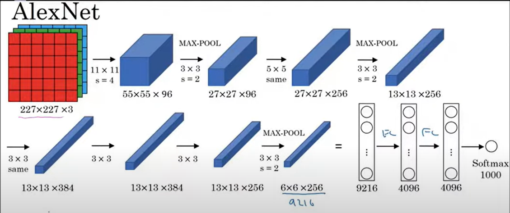

# CNN Famous Architecture

| Architecture | Year | Key Contribution | Layers | Special Features |
|--------------|------|------------------|--------|------------------|
| **AlexNet**  | 2012 | First deep CNN to win ImageNet (top-5 error ↓ from 26% to 15%) | 8 | ReLU activation, dropout, GPU training |
| **ZFNet**    | 2013 | Improved AlexNet by optimizing filter sizes & strides | 8 | Visualized intermediate layers, used 7×7 filters → 5×5 |
| **VGGNet**   | 2014 | Simplified network using only 3×3 convolutions | 16/19 | Deep but uniform design, easy to replicate |
| **GoogLeNet** (Inception v1) | 2014 | Introduced Inception modules for wider networks | 22 | 1×1 convs, no fully connected layers, very efficient |
| **ResNet**   | 2015 | Solved vanishing gradients with residual connections | 18/34/50/101+ | Skip connections, very deep networks (up to 1000+) |

## 🔹 1. AlexNet (2012)

- AlexNet was the first deep CNN that significantly outperformed traditional machine learning methods on the ImageNet challenge.
- It had 8 layers (5 convolutional, 3 fully connected) and used ReLU activation instead of tanh, which made training faster.
- It also introduced dropout to reduce overfitting and overlapping max pooling.
- Training was done using two GPUs in parallel, which was innovative at the time.
- So, AlexNet was a breakthrough model that proved deep learning could scale to large datasets with the right hardware and regularization.

## 🔹 2. ZFNet (2013)
- ZFNet, by Zeiler and Fergus, built directly on top of AlexNet and improved it by tuning hyperparameters through feature map visualization.
- The first conv layer’s filter size was reduced from 11×11 to 7×7, and stride was decreased from 4 to 2, which helped preserve spatial features better.
- It also used deconvolutional techniques to visualize what the network had learned, aiding in model interpretability.
- In short, ZFNet was a refinement of AlexNet, with better filter sizing and interpretability.

## 🔹 3. VGGNet (2014)
- VGGNet simplified the architecture by using a very uniform design — only 3×3 convolutional filters throughout the network, stacked deeper (16 or 19 layers).
- This demonstrated that depth is a key factor in model performance.
- VGG used more layers than AlexNet or ZFNet and had better performance on ImageNet.
- So, VGGNet’s contribution was a very clean, deep, and consistent design, showing that stacking small filters could replace larger filters and still achieve great results.

## 🔹 4. GoogLeNet / Inception v1 (2014)
- GoogLeNet approached the problem differently — instead of going deeper, it went wider using Inception modules.
- Each Inception block performed 1×1, 3×3, 5×5 convolutions and max pooling in parallel, and concatenated the outputs.
- To keep computations efficient, it used 1×1 convolutions as bottlenecks for dimensionality reduction.
- It also removed fully connected layers and used Global Average Pooling, which reduced the number of parameters significantly.
- This was a smart improvement — better accuracy with fewer parameters, and efficient multi-scale feature extraction.

## 🔹 5. ResNet (2015)
- Finally, ResNet solved the biggest problem of going very deep — the vanishing gradient issue.
- It introduced residual connections or skip connections:
- Instead of learning a direct mapping, the network learns a residual (F(x) = H(x) - x ⇒ H(x) = F(x) + x)
- This allowed training of extremely deep networks like ResNet-50, 101, 152, even up to 1000+ layers.
- ResNet was a game-changer because it enabled very deep architectures to be trained reliably, and it remains the backbone of many modern computer vision models.