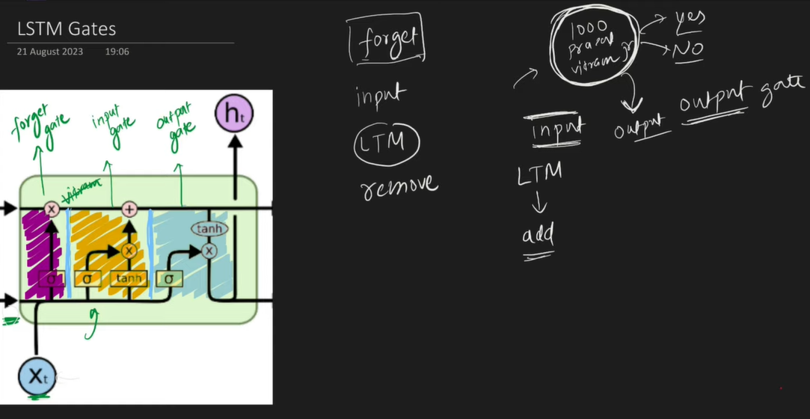
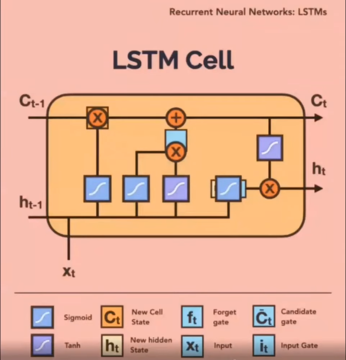

### RNN vs LSTM
- RNNs are simple and easy to understand, but they have limitations in capturing long-term dependencies due to the vanishing gradient problem.
- LSTMs, on the other hand, are more complex but excel at handling long-term dependencies, making them suitable for tasks that require remembering information over extended periods.
- The choice between RNNs and LSTMs depends on the specific requirements of the task and the nature of the data.

### LSTM
- LSTMs are a type of RNN that addresses the vanishing gradient problem by using a gating mechanism.
- LSTMs have three gates: the input gate, the forget gate, and the output gate.
- The input gate controls the flow of information into the cell state- ct (long term memory).
- The forget gate controls the flow of information out of the cell state.
- The output gate controls the flow of information out of the hidden state- ht (short term memory).
- LSTMs have a cell state that can store information for long periods, unlike traditional RNNs that have a single hidden state.

          +---------------+
          |   Cell State  |
          +-------+-------+
                  |
   +--------------v--------------+
   |     Forget Gate (σ)         |
   +-----------------------------+
   |     Input Gate (σ, tanh)    |
   +-----------------------------+
   |     Output Gate (σ, tanh)   |
   +--------------+--------------+
                  |
              Hidden State

| **Model**         | **Memory Span**        | **Computation Cost** | **Use Case**          |
| -----------       | -------------------------- | ----------------     | --------------------------------- |
| **RNN**         | Short                      | Low              | Simple sequential data            |   
| **LSTM**        | Long                       | Medium           | Language, time series forecasting |
| **GRU**         | Long (less than LSTM)      | Lower than LSTM  | Lightweight alternative           |   
| **Transformer** | Very Long (with attention) | High             | NLP, vision, long text modeling   |   

