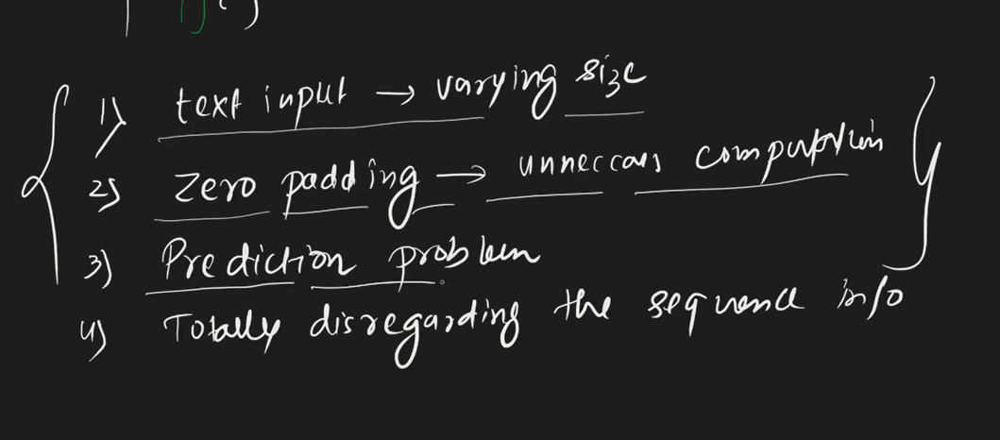
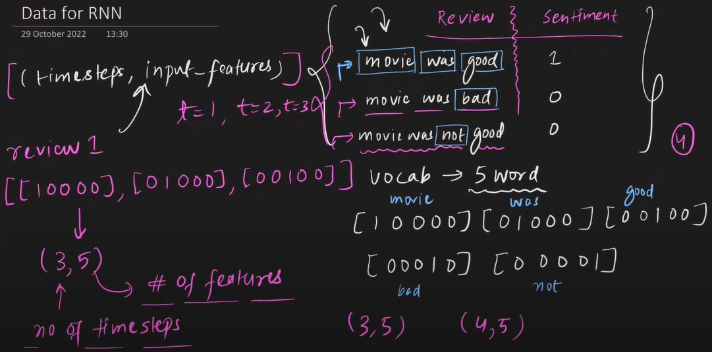
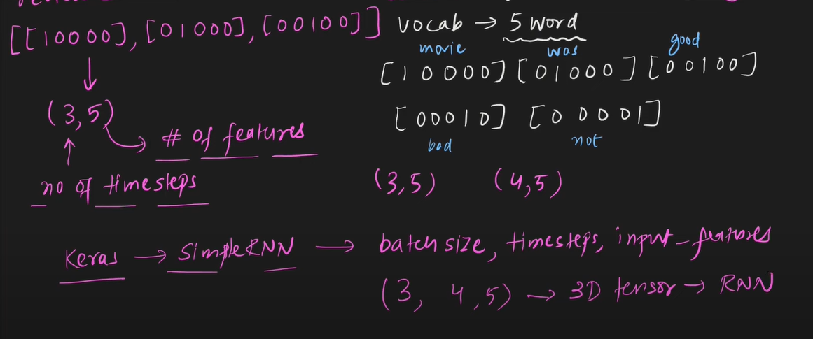
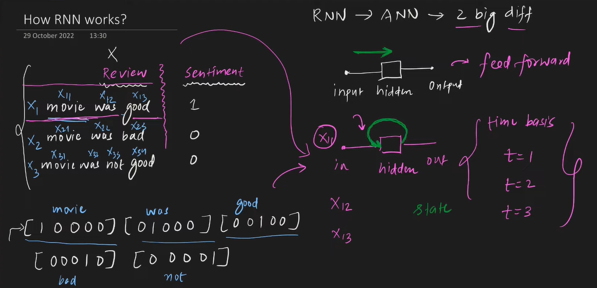
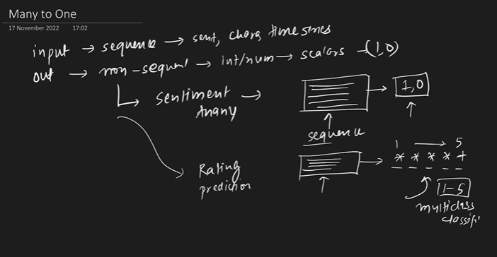
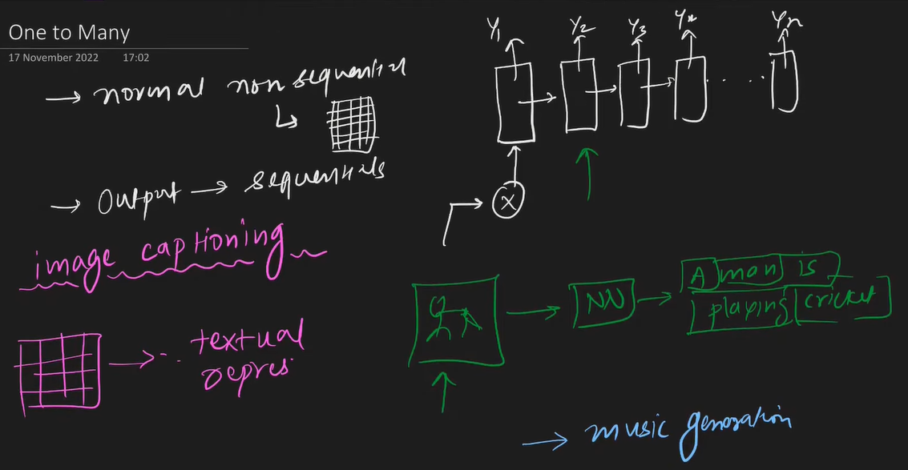
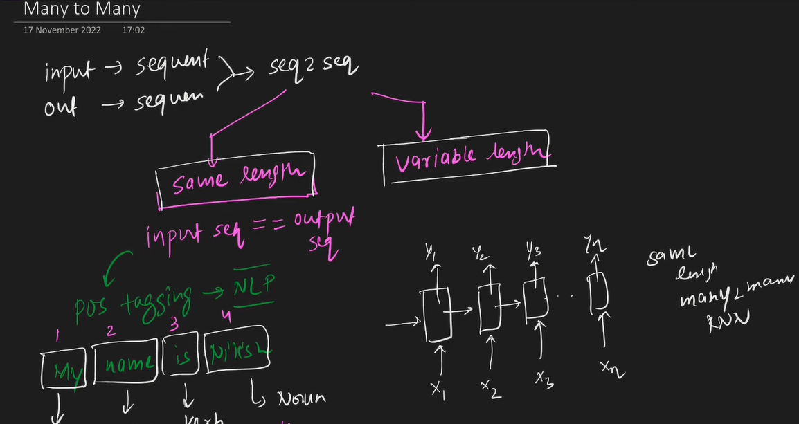

### RNN are specialized Neural network adept at handling Sequential data, where order of input is crucial.

* ✅ Why Choose RNNs?
- RNNs are particularly suited for tasks where the sequence and context of data points are essential.
- Their ability to maintain a memory of previous inputs makes them invaluable for applications involving time-dependent or sequential data.

- Sequential data varying in length whereas ANN has fixed length of data.
- Sequential data contains meaning, RNN captures it in memory.

### RNN Architecture
- RNN input data has form of (timesteps, input_feature)

- In keras we have to input data in (batch_size, timesteps, input_feature)

- RNN has state, so they just won't forward propogate.

- Dense vectors means non-zero values, sparse vectors means few contains Zero Values.
- Word Embedding able to capture semantic meaning and it contains Dense vectors.

### Types of RNN
- Many to One: 
- One to Many: 
- Many to Many:  same lenght: NER, POS tagging, Variable Length: Machine Translate.

- **Sequential Processing:** RNNs process data sequences step-by-step, maintaining a hidden state that captures information about previous elements in the sequence.
- **Hidden State:** At each time step, the network updates its hidden state based on the current input and the previous hidden state, enabling it to retain memory of past inputs.
- **Backpropagation Through Time (BPTT):** To train RNNs, we use a modified version of backpropagation called BPTT, which unrolls the network through time and computes gradients for all parameters.
- **Vanishing/Exploding Gradients:** RNNs can suffer from vanishing or exploding gradients, especially in long sequences, making it hard to learn long-term dependencies.
- **Gated Architectures:** To address the vanishing gradient problem, gated architectures like LSTMs and GRUs were developed. These introduce gates that control the flow of information, allowing RNNs to learn long-term dependencies more effectively
- **Shared Weights:** The same set of weights is applied across all time steps, ensuring consistency in processing sequences of varying lengths.

### 📈 Applications of RNNs
- RNNs are particularly effective in domains where context and sequence order are paramount:
- Natural Language Processing (NLP): Tasks like language modeling, machine translation, and sentiment analysis.
- Speech Recognition: Transcribing spoken words into text.
- Time Series Prediction: Forecasting future values based on historical data.
- Music Generation: Creating sequences of musical notes or compositions.

### ⚠️ Challenges with Standard RNNs
While RNNs are powerful, they encounter specific challenges:

- Vanishing and Exploding Gradients: During training, gradients can become exceedingly small or large, hindering the learning process, especially for long sequences.

- Short-Term Memory: Standard RNNs struggle to capture dependencies that span over long intervals in sequences.
