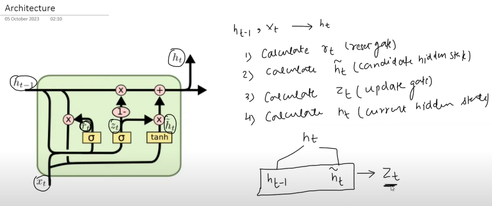

### GRU
- GRU(Gated Recurrent Unit) is a type of RNN that addresses the vanishing gradient problem by using a gating mechanism.
- GRU has two gates: the update gate and the reset gate.
- The update gate controls the flow of information into the hidden state.
- The reset gate controls the flow of information out of the hidden state.
- GRU has a cell state that can store information for long periods, unlike traditional RNNs that have a single hidden state.
- GRU has fewer parameters than LSTM, making it faster to train.
- GRU is less prone to overfitting than LSTM.

### GRU Architecture

### GRU why?
| Feature                | Benefit                                            |
| ---------------------- | -------------------------------------------------- |
| Fewer gates            | Simpler and faster than LSTM                       |
| No separate cell state | Only uses hidden state ($h_t$) for memory          |
| Effective memory       | Captures long-term dependencies like LSTM          |
| Better efficiency      | Requires less computation & memory during training |

### GRU vs LSTM
| Feature       | LSTM                             | GRU                                   |
| ------------- | -------------------------------- | ------------------------------------- |
| Gates         | 3 (input, forget, output)        | 2 (reset, update)                     |
| Cell state    | Separate cell & hidden state     | Only hidden state                     |
| Training time | Slower                           | Faster                                |
| Performance   | Slightly better in complex tasks | Comparable or better in simpler tasks |
| Memory        | Higher                           | Lower                                 |