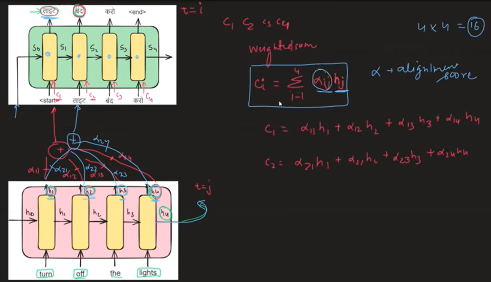

## 🧠 Motivation for Attention
In traditional Seq2Seq (encoder-decoder), the entire input sequence is compressed into a single context vector (last hidden state), which can become a bottleneck, especially for long sequences.

**🔎 Attention solves this by allowing the decoder to look at all encoder hidden states when generating each output.**

### 📌 What is Attention?
* At each decoder time step t, attention helps decide which parts of the input sequence (encoder hidden states) are most relevant for producing output.

**Need to calculate alignment score**

### 📘 Common Scoring Functions
| Score Type            | Formula                               |
| --------------------- | ------------------------------------- |
| **Dot product**       | $h_t^\top \bar{h}_s$                  |
| **General**           | $h_t^\top W_a \bar{h}_s$              | 
| **Concat (Bahdanau)** | $v_a^\top \tanh(W_a[h_t; \bar{h}_s])$ |

`Encoder hidden state and decoder previous hidden state`

### 🧠 Types of Attention Mechanisms

#### A. Bahdanau (Additive) Attention:
**Think of it as learning alignment by combining decoder and encoder states through a feedforward network.**
1. You have:
* Decoder hidden state:
* All encoder hidden states.
2. Compute alignment scores (one for each encoder time step)
3. Convert scores to attention weights (softmax)
4. Compute the context vector

* Uses additive function → MLP (nonlinear)
* Slightly more complex, but performs better on longer sequences
* Learns alignment better for longer sequences.

#### B. Luong (Multiplicative) Attention
1. You have:
* Decoder hidden state:
* Encoder hidden states.
2. Compute alignment scores in 3 variants: Dot, General,Concat
3. Apply softmax to get attention weights
4. Get context vector (same way)

* Simpler and faster.
* Works well for short-to-medium sequences
* More computationally efficient
* Uses dot or general scoring.

| Feature                  | **Bahdanau (Additive)**  | **Luong (Multiplicative)** |
| ------------------------ | ------------------------ | -------------------------- |
| Scoring Function         | MLP (additive)           | Dot product or linear      |
| Complexity               | Higher                   | Lower (faster)             |
| Performance on Long Seqs | Better                   | Good (but can degrade)     |
| Introduced by            | Bahdanau et al., 2015    | Luong et al., 2015         |
| Input to score           | Decoder + Encoder states | Same                       |
