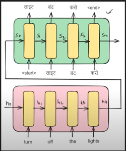

### 📌 What is Seq2Seq (Encoder–Decoder)?
* The Sequence-to-Sequence architecture is designed to transform one sequence into another — e.g., input in English, output in French.

#### 🔁 Basic Idea:
* Encoder processes the input sequence into a fixed-size vector (context).
* Decoder generates the output sequence step-by-step, using that context.

**🧠 It's like understanding a question (encoder) and giving an answer (decoder).**

#### 🧱 Architecture Components
1. Encoder (LSTM/GRU)
* Takes an input sequence: 
* Produces hidden states:
**Final hidden state (and optionally cell state in LSTM) is passed to the decoder**
2. Decoder (LSTM/GRU)
* Takes the final hidden state from the encoder as its initial state
* Predicts the output sequence one token at a time
* Each output is fed back into the decoder at the next step (autoregressive).

#### Applications
| Task                | Input Seq        | Output Seq      |
| ------------------- | ---------------- | --------------- |
| Machine Translation | English sentence | French sentence |
| Text Summarization  | Long paragraph   | Summary         |
| Chatbots            | User message     | Bot response    |
| Speech Recognition  | Audio features   | Text transcript |

#### ! Challenges
| Challenge                | Description                            |
| ------------------------ | -------------------------------------- |
| **Fixed-length vector**  | Bottleneck limits long sequences       |
| **Loss of information**  | Only the final encoder state is passed |
| **Long-term dependency** | May forget early parts of input        |
