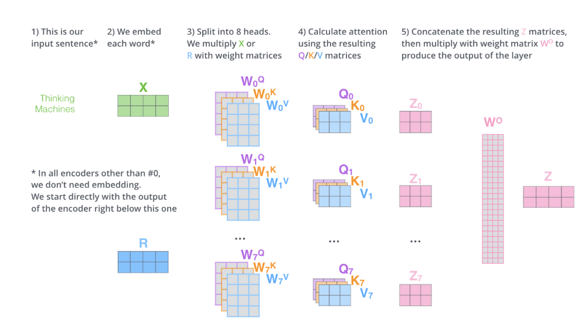

## 🧠 What is Multi-Head Attention?
* Multi-Head Attention runs multiple self-attention operations in parallel, each with its own set of weights (called a “head”).
* Each head focuses on different relationships within the sentence — for example:
- One head may focus on subject-verb links
- Another on semantic similarity
- Another on positional context
**Then we combine all those different insights to get a richer representation of each token.**

## 🔍 Intuition
* Imagine reading a sentence and:
- 👁 One part of your brain looks for who is doing what
- 👂 Another listens for tone
- 🎯 Another tracks order of events
**Each part processes the same sentence differently. At the end, you combine all insights.**
`That’s what multi-head attention does — parallel perspectives.`

## ✅ Benefits of Multi-Head Attention
| Feature               | Why It Matters                                 |
| --------------------- | ---------------------------------------------- |
| Parallelism           | Learns multiple types of relationships         |
| Richer Representation | Captures both **local** and **global** context |
| Efficiency            | Reduces bottlenecks in long sequences          |
| Flexibility           | Every head sees the input **differently**      |

## 📌 Real-World Analogy
Think of 8 people watching the same movie:
* One focuses on dialogues
* One focuses on camera angles
* One notices background music
* Each gives feedback. When you combine it, you get a complete review.

**That’s how multi-head attention combines multiple viewpoints of the same input.**

## Final Summary
*Multi-Head Attention is like running multiple self-attention mechanisms in parallel. Each learns something different about the sequence. The results are then combined to form a richer, more meaningful output for each token.*