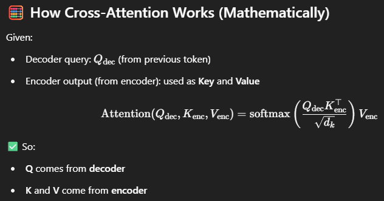

### 🔁 Quick Recap Before Cross-Attention
- In a Transformer:
    - Self-Attention → Token attends to all other tokens in the same sequence.
    - Masked Self-Attention → Token attends only to previous tokens in the same sequence.
    - Cross-Attention → Token attends to another sequence, typically decoder token attends to encoder outputs.

### 🎯 What is Cross-Attention?
- Cross-Attention allows the decoder to attend to the encoder outputs — meaning the decoder can “look back” at the encoded input while generating output tokens.

Input to Decoder
      ↓
Masked Self-Attention
      ↓
💡 Cross-Attention → attends to Encoder Output
      ↓
Feed Forward + LayerNorm

### 📦 Why Cross-Attention is Powerful
| Feature                                      | Benefit                              |
| -------------------------------------------- | ------------------------------------ |
| Connects encoder & decoder                   | Allows decoder to condition on input |
| Handles variable-length input                | Flexible sequence alignment          |
| Learns alignment (like attention in Seq2Seq) | No manual alignment needed           |

### 🔍 Difference from Self-Attention
| Property         | Self-Attention            | Cross-Attention                  |
| ---------------- | ------------------------- | -------------------------------- |
| Operates On      | Same sequence             | Between two sequences            |
| Used In          | Encoder & Decoder         | Decoder only                     |
| Inputs (Q, K, V) | Q = K = V (same sequence) | Q from decoder, K/V from encoder |

**Cross-Attention enables the decoder to learn how each output token relates to the input tokens — by attending to encoder outputs using the decoder’s queries.**

*It’s a key bridge between input and output sequences in sequence-to-sequence models.*