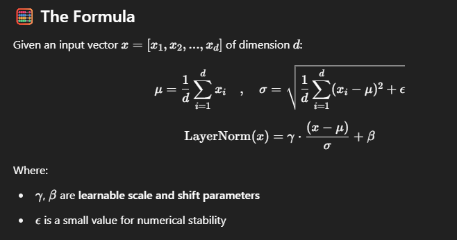

## 🧠 What is Layer Normalization?
* Layer Normalization is a technique that stabilizes and accelerates training by normalizing the inputs across features (dimensions) for each individual data sample (token or layer output).

It ensures that:
- - The mean is 0
- - The standard deviation is 1
- - Performed independently for each input (unlike batch norm)

| Feature               | Layer Normalization            |
| --------------------- | ------------------------------ |
| Normalizes Over       | **Features** (per token/layer) |
| Used In               | **Transformers**, NLP, RL      |
| Depends on Batch Size | ❌ No                           |
| Learnable Params      | ✅ Yes ($\gamma, \beta$)        |
| Works Well For        | **Variable-length sequences**  |

**In Deep Learning we do normalization on input layer and activation functions.**

| Feature                   | **LayerNorm**      | **BatchNorm**            |
| ------------------------- | ------------------ | ------------------------ |
| Normalization over        | Feature dimension  | Across the batch         |
| Batch-size sensitive      | ❌ Independent      | ✅ Depends on batch stats |
| Use case                  | NLP / Transformers | Vision / CNNs            |
| Works on variable length? | ✅ Yes              | ❌ No                     |

### 🤖 Why LayerNorm in Transformers?
In Transformers (like BERT, GPT), we apply LayerNorm:
- After or before self-attention and feed-forward layers
- To stabilize training
- To prevent exploding/vanishing gradients

**Layer Normalization makes deep models like Transformers more stable and faster to train by normalizing activations across features independently for each token**

### Transformers don’t use Batch Normalization because:
* BatchNorm depends on batch statistics, which are unstable or unavailable in sequence models.
* LayerNorm works better with variable-length, autoregressive, or small-batch data, which are common in NLP tasks.

| Feature                          | BatchNorm       | LayerNorm                    |
| -------------------------------- | --------------- | ---------------------------- |
| Normalizes over                  | Batch dimension | Feature dimension per sample |
| Depends on batch size?           | ✅ Yes           | ❌ No                         |
| Suitable for NLP/Transformers    | ❌ No            | ✅ Yes                        |
| Works for variable-length input? | ❌ No            | ✅ Yes                        |
| Preferred in Transformers?       | ❌ No            | ✅ Absolutely                 |
