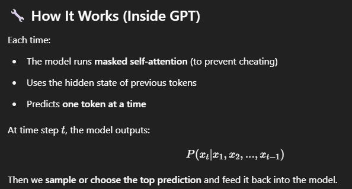

### 🔒 What is Masked Self-Attention?
- Masked self-attention is a version of self-attention where each token can only attend to itself and previous tokens — not future tokens.

- ✅ This is essential for causal (left-to-right) models like GPT, where the model generates text one token at a time.

### 🔁 Regular Self-Attention Recap
- In regular (bidirectional) self-attention:
- - Each token attends to all tokens in the sequence (past, present, future).
- - Used in encoders (like in BERT).

### 🚫 Masked Self-Attention (Causal)
- In masked self-attention:
- - A token cannot attend to any future tokens.
- - It can only attend to previous tokens and itself.
- - This ensures the model cannot cheat by seeing future words during training or generation.

### 📐 How is the Mask Applied?
- Suppose we have an input of 5 tokens:
- ["I", "am", "a", "data", "scientist"]
- Self-attention scores are computed as a 5×5 matrix (dot products between queries and keys).
- To mask future tokens, we apply a triangular mask like this:
Mask Matrix (5x5):
[1, 0, 0, 0, 0]
[1, 1, 0, 0, 0]
[1, 1, 1, 0, 0]
[1, 1, 1, 1, 0]
[1, 1, 1, 1, 1]
- Then we apply this mask before softmax by setting masked positions to −∞ (or a large negative number), so softmax turns them into zero probability.

### 🧮 Attention with Masked Softmax
- Let’s say the raw attention scores for token 3 are:
[2.0, 1.5, 1.0, 0.5, 3.0]
- Token 3 should not see token 4 and 5, so we apply:
[2.0, 1.5, 1.0, -∞, -∞]
- Then apply softmax:
- - Large negative values turn into ~0 probability.
- - Remaining values are normalized to sum to 1.

| Model                         | Why Masking?                                  |
| ----------------------------- | --------------------------------------------- |
| **GPT, GPT-2/3/4**            | Causal language modeling (predict next token) |
| **Decoder in Transformer**    | Prevent future leakage during training        |
| **Autoregressive generation** | Token-by-token prediction                     |

| Aspect                    | Regular Self-Attention | Masked Self-Attention          |
| ------------------------- | ---------------------- | ------------------------------ |
| Can attend to future?     | ✅ Yes                  | ❌ No                           |
| Directionality            | Bidirectional          | Unidirectional (left-to-right) |
| Use Case                  | Encoder (BERT, T5)     | Decoder (GPT, Translation)     |
| Prevents Information Leak | ❌                      | ✅                              |

**Masked self-attention ensures that when predicting token 𝑡𝑖, the model can only attend to tokens before or at position 𝑖 — crucial for autoregressive generation.**

**Autoregressive Generation means generating the output step-by-step, where each new token is predicted based on the previous tokens generated so far.**

- Each token depends only on the previous tokens, not future ones.

### 🧮 Generation Strategies
| Strategy            | Description                                          |
| ------------------- | ---------------------------------------------------- |
| **Greedy**          | Always pick the most probable token                  |
| **Sampling**        | Randomly sample based on the predicted probabilities |
| **Top-k**           | Sample from top-k most probable tokens               |
| **Top-p (nucleus)** | Sample from smallest set whose total prob ≥ p        |
| **Beam Search**     | Keep multiple candidate sequences at each step       |

### 🔄 During Training vs Inference
| Phase         | Process                                    |
| ------------- | ------------------------------------------ |
| **Training**  | Feed full input + mask future tokens       |
| **Inference** | Feed one token at a time, autoregressively |
