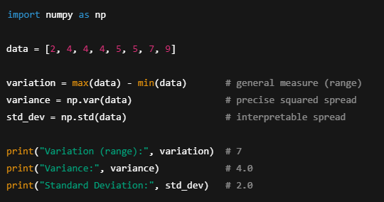
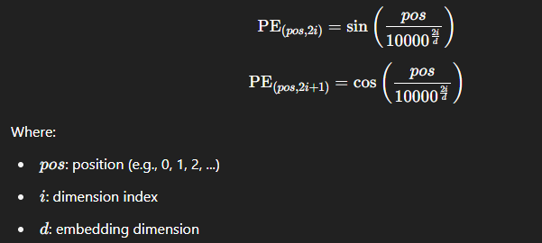

## Positional Encoding:
### ❓ Why Do We Need Positional Encoding?
* Unlike RNNs or CNNs, Transformers don’t process tokens in order — they see the input as a set, not a sequence.
**🧠 But language has structure — "The dog bit the man" ≠ "The man bit the dog".**
* So we need to inject information about position into each token's embedding.
* This is done via Positional Encoding.

### 🧮 What is Positional Encoding?
* It’s a vector added to the word embedding to indicate the position of the word in the sequence.
* Let’s say:
- - Input: "The cat sat"
- - Position indices: 0 → "The", 1 → "cat", 2 → "sat"
- - Each token embedding is combined with a position vector that encodes where it appears in the sequence.

### 📘 Formula: Sinusoidal Positional Encoding (Used in Transformers)
* For position pos and dimension i in the embedding:

### ✅ Properties:
* Uses sinusoidal waves of different frequencies
* Allows the model to learn relative positions
* Does not require learning parameters

### 🔄 How It Works
* For each word, we do:
**Final Input=WordEmbedding + PositionalEncoding**
* This gives each token not only what it is (via embedding) but also where it is.

| Feature               | Advantage                                 |
| --------------------- | ----------------------------------------- |
| No learned parameters | Efficient and simple                      |
| Can generalize        | Works for longer sequences at inference   |
| Encodes distances     | Enables model to infer relative positions |

**Positional Encoding gives each word a sense of where it appears in the sentence — enabling Transformers to understand order, even though they process words in parallel.**