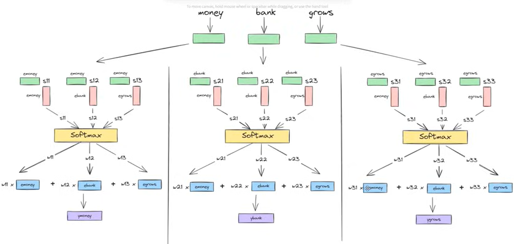
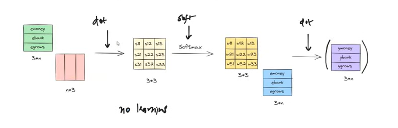
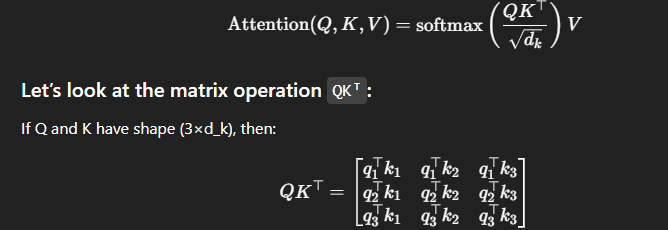
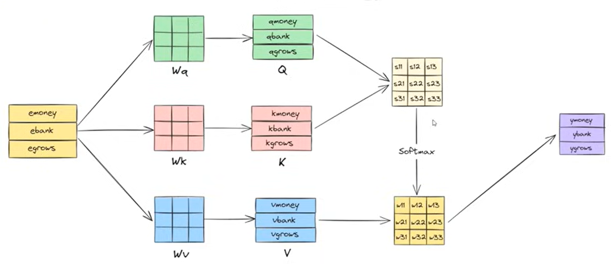
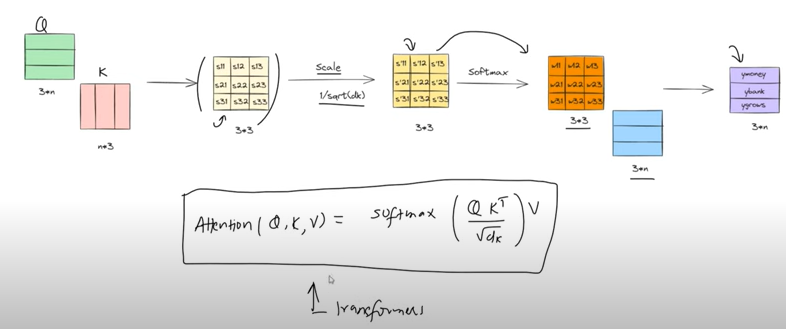

## 🔁 What is Self-Attention?
* In Self-Attention, a sequence learns to attend to itself.
* Each token looks at all other tokens (including itself) in the sequence and decides how much focus it should place on each of them to better represent its meaning.

## 🧠 Imagine This Situation:
* You're reading this sentence:
**"The cat sat on the mat because it was tired."**
* Now you see the word "it" and wonder — what does "it" refer to?
* Your brain quickly checks earlier words — "cat", "mat", etc.
* You decide "it" refers to the cat.
* This is attention in your brain.

**There is no learning parameters involved.**

## Step by Step Working
1. Let’s Take a Simple Input Sequence:(Ask a Question)
`“What other words should I pay attention to?”`
* This is called creating a Query.
* Assume d is the dimension of each token embedding.

2. Compute Queries, Keys, Values(Look Around)
`“What do the other words have to offer?”`
* Each word offers information, which we call Keys and Values.
* Each of Q, K, V is now a matrix of shape (sequence length × d_k):
* Q: Each row is the query vector for a token.
* K: Each row is the key vector for a token.
* V: Each row is the value vector for a token.

3. Scaled Dot-Product Attention(Compare and Score)
`“How relevant is each word to me?”`
The machine compares the query with all the keys and gives scores.

* Each row corresponds to a token's query vector, and the columns are the dot products with every key vector — this gives attention scores between every token pair.

4. Softmax Normalization(Focus)
* Each row of this score matrix is passed through softmax, producing attention weights that sum to 1.
* This gives each token a weighted influence from all other tokens.

5. Weighted Sum with Values:
`“Let’s pay more attention to the important words.”`
* It uses higher scores for more relevant words and lower scores for less important ones.
* The final output for token i is:
* Thus, token i is a weighted combination of all other tokens’ values, based on how much attention it pays to each.

**From single input vector will make 3 new vectors (query vector, key vector, value vector) using linear transformation (multiplication with randomly initialized weight)** 

## 🔍 Why is it Called Self-Attention?
**It's called self-attention because each token is attending to — and learning from — all other tokens in the same input, including itself.**

* It’s "self" because:
* The model is not attending to an external input (like encoder-decoder attention).
* Instead, it’s attending to itself — i.e., all parts of its own input.

## 📦 What Happens in Long Sentences?
* Even in very long sentences (say 100 words), self-attention lets every word look at every other word and decide:
`"Which words help me understand my meaning better?"`
**This is why it's called self-attention — the model is paying attention to itself.**

## ✅ Conclusion
**🔍 In standard self-attention:**
* Each token attends to all tokens via a dot product between its query and all keys.
* It computes how relevant each other token is, and uses this to combine values into a new contextual representation.

**📉 For long sequences, attention complexity becomes 𝑂(𝑛2), but modified architectures address that efficiently.**

| Type of Attention   | What It Looks At                           | Example Use                  |
| ------------------- | ------------------------------------------ | ---------------------------- |
| **Self-Attention**  | Its own sequence (same input)              | GPT, BERT                    |
| **Cross-Attention** | Another sequence (e.g., encoder → decoder) | Translation models (Seq2Seq) |