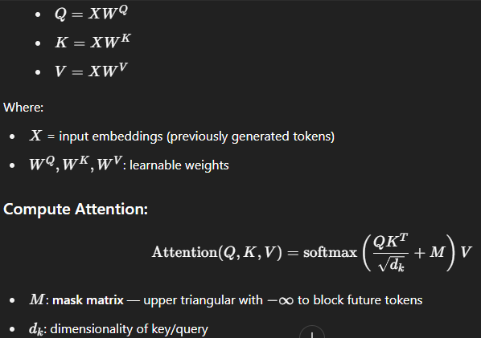
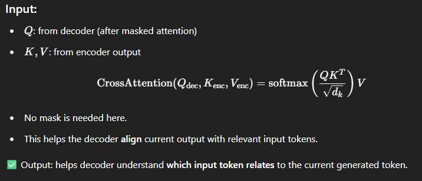
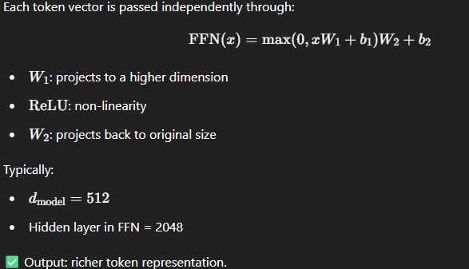

### 🏗️ What is the Transformer Decoder?
The Decoder is the second half of the original Transformer architecture (after the Encoder).
It generates output one token at a time, using both:
- Previous output tokens (via Masked Self-Attention), and
- Encoded input (via Cross-Attention).

### 🔁 When is the Decoder Used?
- Translation (e.g., English → French)
- Summarization
- Text Generation (GPT-like models only use the decoder)
- Image Captioning (via encoder-decoder)

### 🧱 Decoder Architecture Overview
- Each decoder block (repeated N times, usually 6 or 12) has 3 main sub-layers:
Input Embedding + Positional Encoding
          ↓
1️⃣ Masked Multi-Head Self-Attention
          ↓
2️⃣ Cross-Attention (queries from decoder, keys/values from encoder)
          ↓
3️⃣ Feed Forward Neural Network (FFN)
          ↓
Add & LayerNorm after each block

### 🔢 0. Input Embedding + Positional Encoding
Each token in the output sequence is first turned into an embedding:
`𝑥𝑡 = Embedding(𝑤𝑡) + PositionalEncoding(𝑡)`
This gives the model token meaning + position.

### 🔐 1. Masked Multi-Head Self-Attention (Causal Attention)
Ensures that each token can’t see the future tokens — essential for generation.

Step-by-step:
For each token, compute:

- X = input embeddings (previously generated tokens)
- WQ, WK, WV : learnable weights
- M: mask matrix — upper triangular with −∞ to block future tokens
- 𝑑𝑘: dimensionality of key/query
- Softmax distributes weights over past and current tokens only

### 🔁 2. Cross-Attention (Decoder → Encoder Output)
Enables the decoder to attend to encoder outputs while generating.

### 🧮 3. Feed Forward Neural Network (FFN)
Adds capacity to model complex relationships.

Each token vector is passed independently through:

### 🧼 Layer Normalization + Residual Connection
After each sub-layer, the output is:
`Output=LayerNorm(x+SubLayer(x))`
- This stabilizes learning and allows deeper models by helping gradients flow.

### 🔚 Final Linear Layer + Softmax
At the end of the last decoder block:
`Logits = DecoderOutput ⋅ 𝑊𝑇`
`Probabilities = Softmax(Logits)`

Where:
- 𝑊𝑇 : weight matrix shared with embedding layer (tied embeddings)
- Softmax gives probabilities over the vocabulary.

### ✅ Summary Table
| Component             | Role                                             |
| --------------------- | ------------------------------------------------ |
| Masked Self-Attention | Attend to past tokens only (causal generation)   |
| Cross-Attention       | Attend to encoder outputs (align input & output) |
| Feed-Forward Network  | Increase representation power                    |
| LayerNorm + Residual  | Stabilize gradients and training                 |
| Final Softmax Layer   | Convert to probability over vocabulary           |
