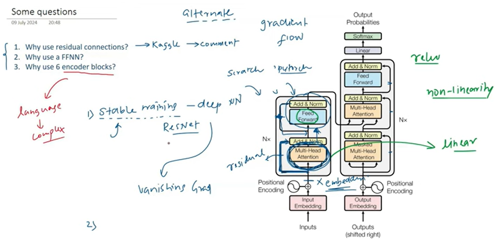
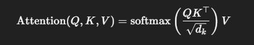
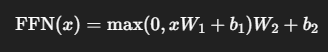

## Transformer (Encoder)

* The encoder takes an input sequence (e.g., a sentence) and turns it into a `context-aware vector representation` — meaning it understands each word in the context of the whole sentence.

* It does this through stacked layers, each containing:
- - Multi-Head Self-Attention
- - Feed Forward Network
- - Layer Normalization
- - Residual Connections

Input Embedding
     ↓
Positional Encoding
     ↓
[1] Multi-Head Self-Attention
     ↓
[2] Add & LayerNorm
     ↓
[3] Feed Forward Network
     ↓
[4] Add & LayerNorm
     ↓
Output to next encoder layer or decoder

### 🔹 1. Input Embedding + Positional Encoding
- 🔠 Word Embedding:
* Each word/token is converted to a vector (e.g., 512-dimensional) using an embedding layer.

- 🧭 Positional Encoding:
* Since Transformers don't have recurrence, we add position info using a sinusoidal function:
**Input𝑖 = Embedding𝑖 + PositionalEncoding𝑖**
* So the model knows: “cat” came after “The”, not before.

### 🔹 2. Multi-Head Self-Attention (MHSA)
- 🧠 Goal:
* Let each token pay attention to all other tokens in the sequence and weigh them differently.
* For each token:
Create Query (Q): What am I looking for?
Create Key (K): What do I offer?
Create Value (V): What information do I hold?

* This gives a weighted sum of all tokens → capturing their context.

### 🔹 3. Add & LayerNorm (Post-Attention)
- 🧮 Residual Connection:
* We add the input to the attention output:
- Out1 = LayerNorm(Input + MHSA)
- This helps gradients flow better and prevents vanishing/exploding.

- 🧪 LayerNorm:
* Normalizes across the features to stabilize learning.

### 🔹 4. Feed-Forward Neural Network (FFN)
- Every token’s output is passed independently through a 2-layer MLP:

- This helps the model:
* Transform and project information
* Increase model capacity

### 🔹 5. Add & LayerNorm (Post-FFN)
- Again, we apply residual connection + normalization:
- - Out2 = LayerNorm(Out1 + FFN(x))

### 🔁 6. Stack of N Layers
A Transformer encoder typically stacks 6 to 12 of these layers.
Each layer builds more complex features — from shallow to deep understanding.

The final output of the encoder is:
- A sequence of vectors: one per token

- Each vector captures:
The word meaning
Its position
Its context and relation with all other words

- This output is then passed to:
* The decoder (in translation tasks), OR
* The next prediction head (like in BERT/GPT)**

| Component            | Role                                   |
| -------------------- | -------------------------------------- |
| Word Embedding       | Turns tokens into vectors              |
| Positional Encoding  | Adds order information                 |
| Self-Attention       | Each word learns context from others   |
| Feed Forward Network | Projects and transforms representation |
| Residual + LayerNorm | Stabilizes and strengthens training    |
| Stack of N layers    | Learns deeper contextual features      |