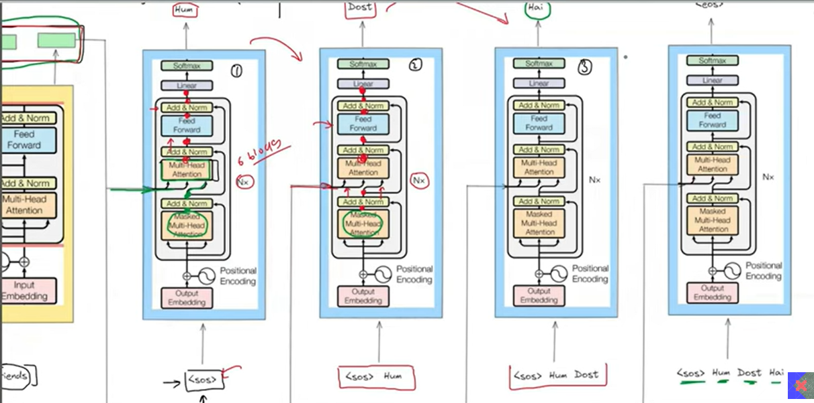
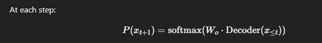

### 🧠 What is Inference?
`Inference is the process of using a trained model to generate predictions.`
For Transformers, especially in autoregressive generation, this means generating output one token at a time, using the model’s knowledge and the previously generated tokens.

### 📦 Key Inference Scenario
Let’s say you have a prompt:
"The cat sat on"
- And you ask the model to predict the next word. In inference:
- The model encodes "The cat sat on"
- Predicts: "the"
- Appends "the" to input → "The cat sat on the"
- Predicts next → "mat"
- Repeats until:
- EOS (end-of-sequence) token is produced, or
- A max length is reached

### 🔁 Inference Loop (Autoregressive)
Let’s denote:
𝑥1,𝑥2,....,xt : previously generated tokens
𝑥𝑡+1 : next token to be predicted

- Decoder takes all previous tokens
- Output is projected to vocabulary space using 𝑊𝑜
- Softmax gives probabilities
- We select the next token via:
- - Greedy decoding
- - Sampling
- - Top-k / Top-p

### 🔐 Why It's Slow (Compared to Training)
In training:
- We can process entire sequences in parallel, thanks to masking.

In inference:
- Each token is generated sequentially.
- Requires feeding previous outputs as input at every step.

This is why:
- Inference latency is high.
- Optimizations like KV caching (key-value caching) are used in large LLMs.

### ⚙️ Inference Steps (Decoder-only Transformer like GPT)
1. Tokenize the input (e.g., "The cat" → 1012, 1984)
2. Embed + add positional encoding
3. Pass through decoder layers
4. Compute logits over vocabulary
5. Apply softmax to get probabilities
6. Select next token (greedy, sampling, etc.)
7. Repeat from step 2, with new token appended

### 🔑 Decoding Strategies
| Strategy            | Description                                                |
| ------------------- | ---------------------------------------------------------- |
| **Greedy**          | Always pick the most probable token                        |
| **Sampling**        | Sample randomly from the distribution                      |
| **Top-k**           | Sample from top-k most probable tokens                     |
| **Top-p (nucleus)** | Sample from the smallest set of tokens whose probs sum ≥ p |
| **Beam Search**     | Keep multiple sequences and expand the best ones           |

### ⚡ Optimization: Key-Value (KV) Caching
In long sequences, recomputing attention at every step is inefficient.

Solution:
- Store keys and values from previous steps.
- Reuse them in future steps.
- Only compute attention with newest token's query.

This drastically speeds up inference, especially in LLMs (like GPT-3/4).

### ✅ Summary
| Feature                 | Description                                                |
| ----------------------- | ---------------------------------------------------------- |
| Autoregressive          | Token-by-token generation, each depends on the previous    |
| Masked Self-Attention   | Prevents peeking at future tokens                          |
| Uses Decoder            | Decoder-only for GPT, both Encoder and Decoder in T5, BART |
| Inference Loop          | Embed → Decode → Predict → Append → Repeat                 |
| Slower than training    | Due to sequential token generation                         |
| Optimized by KV caching | For faster transformer inference                           |
