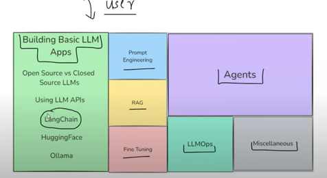

## Langchain
**LangChain is a powerful framework specifically designed for building applications using large language models (LLMs) in a modular, composable, and scalable way.**

## 🔍 Why LangChain Exists
* LangChain was built to solve real-world problems that arise when integrating LLMs into applications:

1. LLMs Alone Are Not Enough
LLMs like GPT-4 can generate, summarize, or translate text — but:
- They lack memory
- They can't access external tools (APIs, DBs, filesystems)
- They don’t maintain long-term context

LangChain helps address these by:
- Adding contextual memory (chat history)
- Allowing tool use (e.g., Google search, APIs, DBs)
- Enabling retrieval-augmented generation (RAG)

## 🧠 Core Components of LangChain
LangChain is organized into modules. Here’s what they do:
| Component            | Purpose                                                         |
| -------------------- | --------------------------------------------------------------- |
| **LLMs/Chat Models** | Abstracts models like OpenAI, Anthropic, Cohere, etc.           |
| **Prompts**          | Composable and templated prompts for consistent generation      |
| **Chains**           | Sequences of steps (prompt → LLM → output)                      |
| **Agents**           | LLMs that decide what tools to use and how                      |
| **Memory**           | Retains chat history across interactions                        |
| **Retrieval**        | Connects to vector databases (Pinecone, FAISS, Chroma) for RAG  |
| **Tools**            | Integrates with external tools (search, DBs, Python REPL, etc.) |

## 🧠 Tips to Use LangChain at Its Max Potential
1. Use LangSmith for Tracing & Debugging
Understand what’s happening inside your chains, agents, and memory.

2. Split Logic into Chains & Reuse
Don’t hard-code logic in one monolithic function. Build composable chains.

3. Fine-tune Prompt Templates
Use PromptTemplate for modular, reusable, dynamic prompting.

4. Integrate Vector DBs Wisely
Choose the right DB based on scale: Chroma (local), Pinecone (cloud), FAISS (lightweight).

5. Use Streaming for Better UX
Stream LLM responses to your frontend for faster feedback.

6. Combine Tools Intelligently
Agents work better when each tool has a well-defined responsibility.

## 🧪 Example Project Ideas
| Use Case            | Description                                         |
| ------------------- | --------------------------------------------------- |
| **Document Q\&A**   | Upload docs → Embed → Ask questions                 |
| **Support Chatbot** | Integrate memory + search tool + OpenAI GPT         |
| **AI Analyst**      | Connect to SQL DB → Natural language to SQL queries |
| **Auto Agent**      | Let the LLM decide tool usage for complex tasks     |
