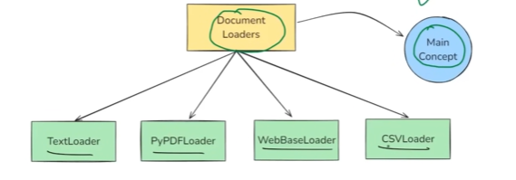

## 📌 What Are Document Loaders?
Document loaders are utilities in LangChain that let you ingest unstructured or semi-structured data from various sources (PDFs, websites, databases, cloud storage, etc.) and convert it into a standard document format for downstream processing.
**✅ Output: A list of Document objects, each having .page_content (text) and .metadata.**

## ❓ Why Do We Need Document Loaders?
| Problem                                      | Solution via Document Loader                       |
| -------------------------------------------- | -------------------------------------------------- |
| Raw data in various formats (PDF, CSV, HTML) | Loaders convert them to unified `Document` objects |
| Need context for LLMs from files or APIs     | Load documents → chunk → embed → query (RAG)       |
| Metadata like filename, page number, source  | Loaders attach it automatically                    |

## Popular Built-in Loaders (by Source Type)
| **Source Type**  | **Loader**                               | **Description**                          |
| ---------------- | ---------------------------------------- | ---------------------------------------- |
| 📄 PDF           | `PyPDFLoader`, `PDFMinerLoader`          | Extracts text from PDF pages             |
| 🌐 Webpage       | `WebBaseLoader`                          | Load and clean text from URLs            |
| 📊 CSV/Excel     | `CSVLoader`, `UnstructuredExcelLoader`   | Loads rows as documents                  |
| 🧾 Text/Markdown | `TextLoader`, `MarkdownLoader`           | Reads local `.txt` or `.md` files        |
| 🛠️ JSON         | `JSONLoader`, `JSONLinesLoader`          | Converts JSON fields to text             |
| 🔌 Notion        | `NotionDBLoader`                         | Load from Notion workspace via API       |
| ☁️ Google Docs   | `GoogleDocsLoader`                       | Load documents from your Google Drive    |
| 🧠 YouTube       | `YoutubeLoader` (with transcript)        | Loads transcripts from YouTube videos    |
| 📂 Directory     | `DirectoryLoader`                        | Loads multiple files using child loaders |
| 🧾 HTML/Web      | `BSHTMLLoader`, `UnstructuredHTMLLoader` | Parses HTML content from files/pages     |
