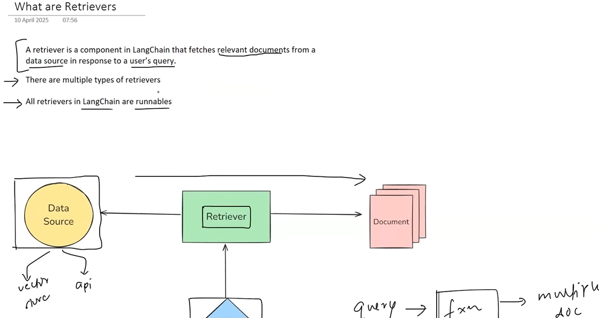
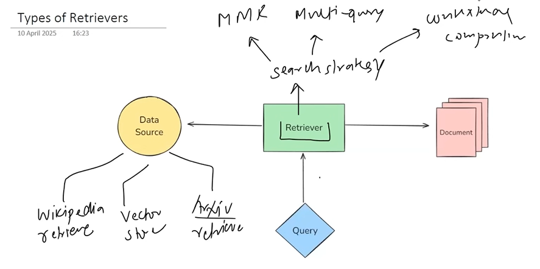
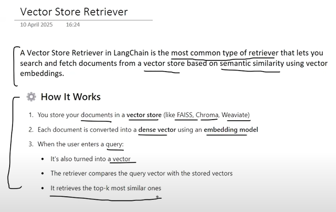

## 📌 What Is a Retriever?
A Retriever is a component that takes a user query and returns relevant documents (usually text chunks) from a knowledge base (often a vector store).
- 📦 Output: List of Document objects relevant to the query.
- It’s like a semantic search engine in your GenAI pipeline.

## ✅ Why Do We Need Retrievers?
| Problem                                | Retriever Solution                                     |
| -------------------------------------- | ------------------------------------------------------ |
| LLMs are stateless (no memory of past) | Inject relevant context into prompts                   |
| Need up-to-date or private knowledge   | Retrieve from internal sources (PDFs, databases, APIs) |
| Reduce hallucination in LLM answers    | Ground LLM response with retrieved facts               |

