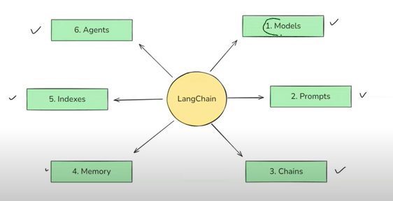
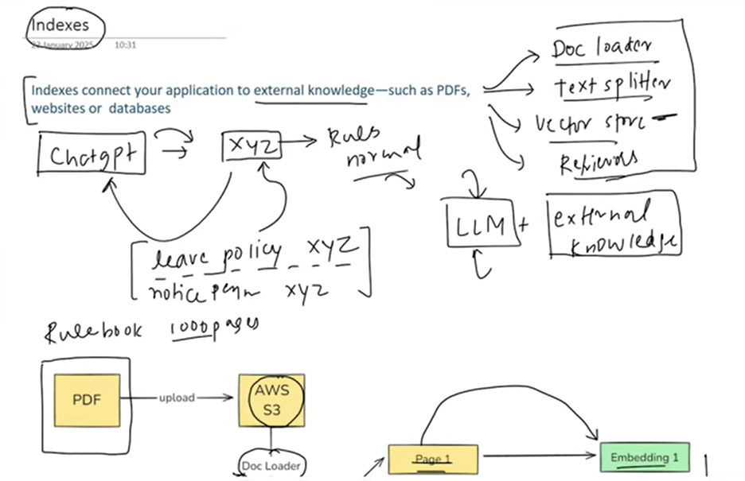
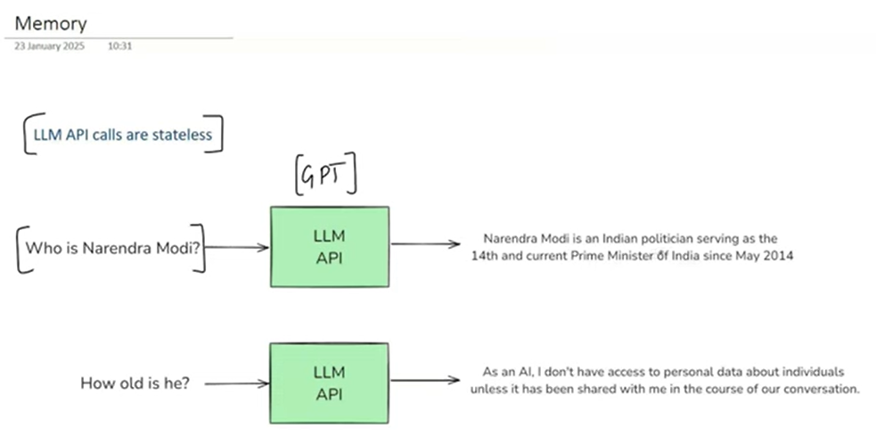
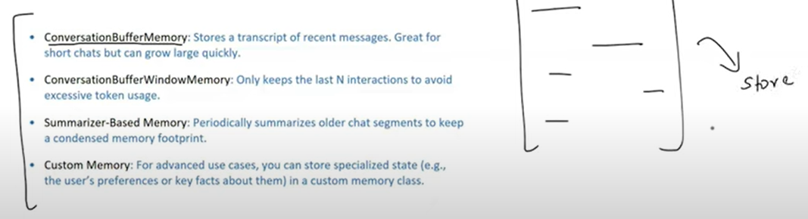

# ✅ LangChain Components Overview

## 🧠 1. Models
`Purpose:` Interface with LLMs (e.g., GPT-4), chat models, or embedding models.
`Why:` Abstracts away model-specific API calls.
`Use Cases:` Text generation, Q&A, classification, embeddings for RAG.
`Dev Benefits:`
- Unified API for OpenAI, Cohere, Anthropic, Hugging Face, etc.
- Easy switching between providers
- Built-in support for streaming, config, callbacks
**✅ Simplifies connecting and configuring LLMs across multiple vendors.**

## 🧾 2. Prompts
`Purpose:` Standardize and structure the way prompts are created, reused, and dynamically formatted.
`Why:` Prompt quality directly impacts LLM output.
`Use Cases:` Prompt templates, few-shot examples, system/user role chat formatting.
`Dev Benefits:`
- Templated prompt generation (PromptTemplate, ChatPromptTemplate)
- Few-shot learning support
- Dynamic variables and chaining input
**✅ Enables modular, reusable, and error-resistant prompting.**

## 🔗 3. Chains
`Purpose:` Compose sequences of calls — combining prompts, LLMs, and logic into a single pipeline.
`Why:` Real-world tasks require multi-step interactions.
`Use Cases:`
- QA systems: (prompt → LLM → answer)
- Summarization pipelines
- RAG flows
`Dev Benefits:`
- Reusable modular chains (LLMChain, SimpleSequentialChain, RetrievalQA)
- No need to manually handle intermediate steps
- Supports custom chains
**✅ Encourages clean, scalable task orchestration.**

## 📇 4. Indexes (aka Vector Stores)

`Purpose:` Store and retrieve documents efficiently for retrieval-augmented generation (RAG).
`Why:` LLMs lack memory and context beyond prompt length.
`Use Cases:`
- Document Q&A (PDFs, websites, notes)
- Chat over knowledge base
`Dev Benefits:`
- Integrations with FAISS, Chroma, Pinecone, Weaviate
- Embedding + similarity search in one call
- Easy document ingestion (load, split, embed, store)
**✅ Powers accurate, contextual responses over large corpora.**

## 🧠 5. Memory

`Purpose:` Retain conversation history or task state across multiple interactions.
`Why:` LLMs are stateless by default.
`Use Cases:`
- Conversational agents
- Multi-turn chatbots
- Stateful workflows
`Dev Benefits:`
- Supports buffer, summary, token-limited memory types
- Easily plugs into chat chains or agents
- Configurable memory window
**✅ Allows LLMs to maintain continuity like a real human conversation.**

## 🦾 6. Agents
`Purpose:` Enable dynamic decision-making by allowing LLMs to choose which tools to use at runtime.
`Why:` Real-world tasks often need tools (e.g., calculator, search, DB).
`Use Cases:`
- Autonomous AI agents
- Natural language to SQL or API workflows
- Multi-step tool use with planning
`Dev Benefits:`
- Comes with built-in tools (Python, Search, Calculator, etc.)
- Agent types: zero-shot-react, chat-conversational, etc.
- Reduces hardcoded logic in apps
**✅ Adds autonomy and tool-using capabilities to your GenAI apps.**

| Component   | Purpose                                       | Example                          |
| ----------- | --------------------------------------------- | -------------------------------- |
| **Models**  | Interface with LLMs / Embeddings              | ChatOpenAI, HuggingFaceHub       |
| **Prompts** | Dynamic and structured prompt generation      | PromptTemplate, ChatPrompt       |
| **Chains**  | Connect multiple steps (LLM + logic)          | RetrievalQAChain, LLMChain       |
| **Indexes** | RAG: Store & retrieve documents as embeddings | Chroma, FAISS                    |
| **Memory**  | Maintain context across steps / turns         | ConversationBufferMemory         |
| **Agents**  | Let LLMs decide which tools to use            | Calculator, Search, Custom Tools |