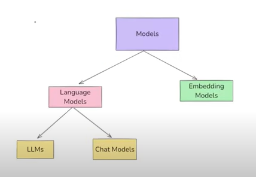
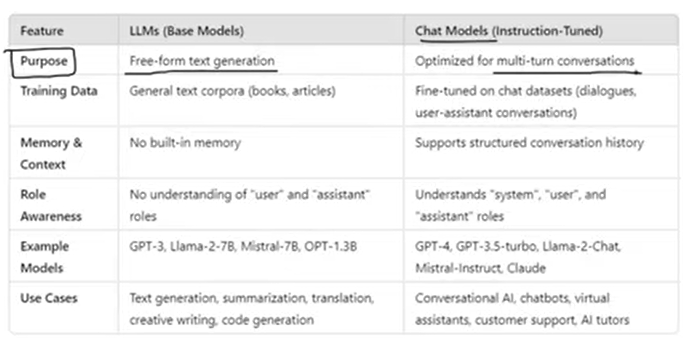
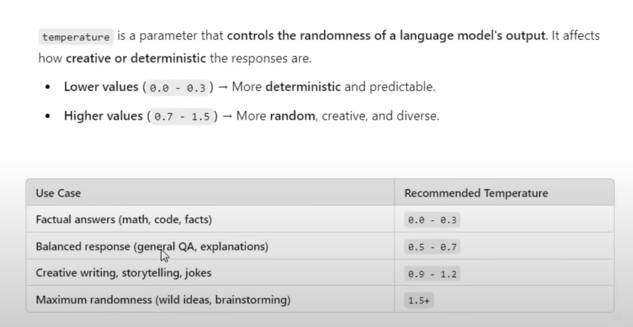

# Models

In LangChain, the Models component serves as the foundation — it enables integration with LLMs, chat models, and embedding models from various providers. This layer abstracts away the complexity of dealing with different APIs or SDKs and gives you a standardized interface to interact with language models and embedding providers.

## ✅ Why the Models Component Exists
* Abstraction: Unified interface across providers (OpenAI, Anthropic, Cohere, Hugging Face, etc.)
* Flexibility: Easily switch between providers/models without changing your app logic
* Configurability: Allows temperature, max tokens, streaming, system prompts, etc.
* Extensibility: You can register or build your own custom models

## 🧱 Main Model Types in LangChain
1. Language Models
- 🔤 LLMs
For text completion-based models (e.g., GPT-3, Cohere Command, etc.)
-  💬 Chat Models
For chat-oriented models (e.g., GPT-4, Claude, Gemini)
➡️ Chat models work with a list of messages and support role-based formatting (system, user, assistant).

2. 🧠 Embeddings Models
Used for converting text into high-dimensional vectors, useful for similarity search and retrieval-augmented generation (RAG).
Other supported providers:
HuggingFaceEmbeddings
SentenceTransformers
CohereEmbeddings
AzureOpenAIEmbeddings
GooglePalmEmbeddings

## 🛠️ Advanced Configuration
You can control various generation parameters:
| Parameter                          | Use                          |
| ---------------------------------- | ---------------------------- |
| `temperature`                      | Creativity vs determinism    |
| `max_tokens`                       | Output length limit          |
| `top_p`, `frequency_penalty`, etc. | Sampling control             |
| `streaming=True`                   | Real-time response streaming |
| `callbacks`                        | Track usage, errors, tokens  |

