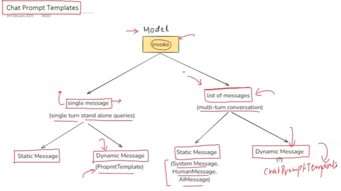

## 🔍 1. Why Prompts Matter
* Prompts are the primary way we instruct large language models (LLMs). In GenAI apps, prompt engineering is crucial because:
- The same model behaves differently with different prompts.
- Prompts often require dynamic inputs (e.g., questions, chat history, documents).
- Prompt reuse, versioning, and clarity are essential in real-world apps.
- LangChain’s prompts module gives you a structured, modular, and reusable way to handle all of this.

## 🧠 2. Key Classes and Types of Prompts in LangChain
1. PromptTemplate
This is the most common and basic prompt format — like a string with placeholders.
```python
from langchain.prompts import PromptTemplate

prompt = PromptTemplate(
    input_variables=["topic"],
    template="Write a short paragraph about {topic}."
)

print(prompt.format(topic="LangChain"))
```
`Use Case:`
- Dynamic single-shot prompts
- Injecting data like document content, user query, etc.

2. ChatPromptTemplate
Structured prompt format used with chat models like GPT-4, Claude, etc. 
It supports message roles like system, user, assistant.

```python
from langchain.prompts import ChatPromptTemplate

chat_prompt = ChatPromptTemplate.from_messages([
    ("system", "You are a helpful assistant."),
    ("human", "What is the weather like in {location}?")
])

chat_prompt.format_messages(location="Delhi")
```
`Use Case:`
- Multi-turn chatbots
- Agents that use chat-based LLMs

3. FewShotPromptTemplate
Allows you to add few-shot examples (input/output pairs) before the actual task to demonstrate patterns.
```python
from langchain.prompts import FewShotPromptTemplate

examples = [
    {"input": "2 + 2", "output": "4"},
    {"input": "5 + 7", "output": "12"}
]

example_prompt = PromptTemplate(
    input_variables=["input", "output"],
    template="Input: {input}\nOutput: {output}"
)

few_shot_prompt = FewShotPromptTemplate(
    examples=examples,
    example_prompt=example_prompt,
    suffix="Input: {user_input}\nOutput:",
    input_variables=["user_input"]
)

few_shot_prompt.format(user_input="8 + 3")
```
`Use Case:`
- In-context learning
- Pattern demonstration (e.g., grammar correction, QA)

4. MessagesPlaceholder
Used with memory and chat templates to inject dynamic message history into a chat model prompt.
```python
from langchain.prompts.chat import ChatPromptTemplate, MessagesPlaceholder

chat_prompt = ChatPromptTemplate.from_messages([
    ("system", "You are a helpful assistant."),
    MessagesPlaceholder(variable_name="chat_history"),
    ("human", "{input}")
])
```
`Use Case:`
- Chatbots with memory
- Dynamic injection of previous turns in multi-turn dialogue

## 🧰 3. Prompt Composition in Chains
Prompts are plugged into chains like this:
```python
from langchain.llms import OpenAI
from langchain.chains import LLMChain

llm = OpenAI(temperature=0.7)
chain = LLMChain(llm=llm, prompt=prompt)

chain.run(topic="Generative AI")
```
This enables structured and dynamic prompt execution within workflows.

## ⚙️ 4. Advanced Features
| Feature                  | Description                                             |
| ------------------------ | ------------------------------------------------------- |
| **Partial Filling**      | Pre-fill some values in a template                      |
| **Validation**           | Ensures required variables are supplied                 |
| **String Interpolation** | Uses Python `.format()` style                           |
| **Prompt Serialization** | Prompts can be saved/loaded for reuse                   |
| **Streaming Support**    | Prompts are stream-compatible when using streaming LLMs |

## ✅ 5. Summary of Prompt Types
| Type                    | Used For                           | LLM Type        |
| ----------------------- | ---------------------------------- | --------------- |
| `PromptTemplate`        | Simple templates with variables    | Text-based LLMs |
| `ChatPromptTemplate`    | Role-based chat formatting         | Chat-based LLMs |
| `FewShotPromptTemplate` | Example-driven in-context learning | Any             |
| `MessagesPlaceholder`   | Inject chat memory/history         | Chat-based LLMs |

| Scenario          | Prompt Strategy                             |
| ----------------- | ------------------------------------------- |
| **Document Q\&A** | PromptTemplate with document + question     |
| **Chatbot**       | ChatPromptTemplate with system + user roles |
| **AI Tutor**      | FewShotPromptTemplate to guide answer style |
| **SQL Agent**     | PromptTemplate with query + schema info     |
