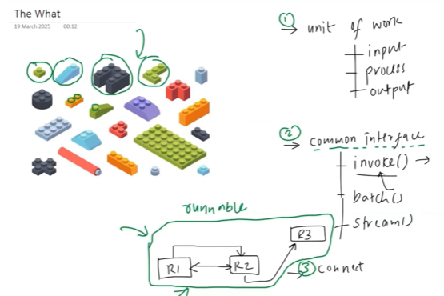
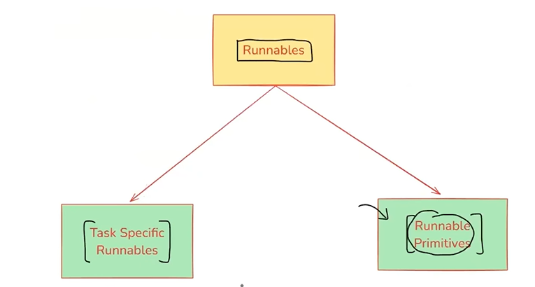
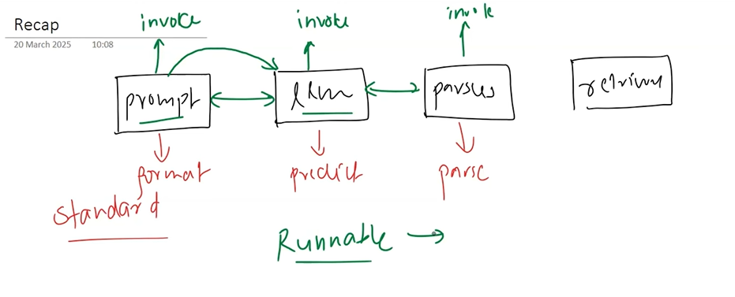

## 📌 What Are Runnables?
Runnables are the building blocks of LangChain Expression Language (LCEL).
Any component that implements the Runnable interface can be:
- Chained with others using the | operator (pipe syntax)
- Invoked, batched, streamed, and more




**🔁 In short, Runnables = standardized components that can be run like functions, composed like pipelines, and reused easily.**

## Why Runnables Exist?
| Challenge (Before)                                  | Runnables Solve This By...                     |    |
| --------------------------------------------------- | ---------------------------------------------- | -- |
| No unified interface for models, chains, retrievers | Providing a consistent `.invoke()` interface   |    |
| Difficult to build dynamic pipelines                | Supporting flexible composition using \`       | \` |
| Poor scalability for batch/streaming                | Enabling `.batch()`, `.stream()`, `.ainvoke()` |    |

## Benefits of Runnables
| Feature              | Benefit                                                 |
| -------------------- | ------------------------------------------------------- |
| 🔄 Unified Interface | Models, prompts, retrievers, chains all behave the same |
| 🔗 Pipe Composition  | Easily build custom chains: \`prompt | model | parser\` |
| 🧪 Testability       | Each runnable can be tested independently               |
| 🚀 Parallelism       | Use `.batch()` and `.stream()` for high performance     |
| 🔁 Async Support     | Use `.ainvoke()` for async pipelines                    |

## Core Runnable Methods
| Method          | Description                      |
| --------------- | -------------------------------- |
| `.invoke()`     | Run on a single input (sync)     |
| `.ainvoke()`    | Run on a single input (async)    |
| `.batch()`      | Run on multiple inputs           |
| `.stream()`     | Get a generator/stream of tokens |
| `.pipe()`       | Chain multiple runnables together |

## 🧰 Common Runnables in LangChain
| Runnable Type        | Example                         |
| -------------------- | ------------------------------- |
| `PromptTemplate`     | Formats text                    |
| `LLM` or `ChatModel` | Generates text                  |
| `OutputParser`       | Parses model output             |
| `Retriever`          | Gets documents from a vector DB |
| `RunnableLambda`     | Wraps custom Python logic       |

1. Runnable Sequence:
A sequence of Runnables, composed using | (pipe), where the output of one is passed to the next.

🧰 Use Cases:
- End-to-end pipelines: prompt → LLM → parser
- Clean modularization of multi-step logic
- RAG, QA, summarization chains

✅ Example:
```python
from langchain.prompts import PromptTemplate
from langchain.chat_models import ChatOpenAI
from langchain.output_parsers import StrOutputParser

prompt = PromptTemplate.from_template("Explain {topic} in simple terms.")
llm = ChatOpenAI()
parser = StrOutputParser()

chain = prompt | llm | parser
chain.invoke({"topic": "retrieval-augmented generation"})
```
🔍 Key Feature:
- Composition-friendly (chained with |)
- Used internally for most LCEL workflows

2. RunnableParallel
Runs multiple Runnables concurrently (in parallel), each receiving the same input, and returns a list of outputs.

🧰 Use Cases:
- Run multiple LLM chains for different tasks (e.g., summary + sentiment)
- Model comparison
- Multi-output data generation

✅ Example:
```python
from langchain.schema.runnable import RunnableParallel

parallel = RunnableParallel([chain1, chain2])
parallel.invoke("AI is transforming the world.")
```
📝 Output:
- Returns a list of results, one for each Runnable.

3. RunnableBranch
Acts like an if-else logic gate — it chooses one runnable path based on the input.

🧰 Use Cases:
- Routing logic (e.g., route chat vs command vs question)
- Tool selection
- Conditional formatting or response logic

✅ Example:
```python
from langchain.schema.runnable import RunnableBranch

branch = RunnableBranch(
    (lambda x: "math" in x.lower(), math_chain),
    (lambda x: "weather" in x.lower(), weather_chain),
    default_chain
)

branch.invoke("What is 2 + 2?")
```
🔍 Key Feature:
- Evaluates each condition in order
- Runs only the first matching Runnable

4. RunnablePassthrough
Simply returns the input as the output, unchanged. Acts as a noop (no-operation).

🧰 Use Cases:
- Debugging
- Placeholder for testing in complex chains
- Optional steps (e.g., “skip if no processing needed”)

```python
from langchain.schema.runnable import RunnablePassthrough

passthrough = RunnablePassthrough()
passthrough.invoke("This will be returned unchanged.")
```

5. RunnableLambda
Wraps a custom Python function (sync or async) as a Runnable — used for logic injection, formatting, filtering, etc.

🧰 Use Cases:
- Custom logic (e.g., text cleaning, JSON transformation)
- Pre/post processing between steps
- On-the-fly conditional transformations

```python
from langchain.schema.runnable import RunnableLambda

uppercase = RunnableLambda(lambda x: x.upper())
uppercase.invoke("langchain")  # Output: LANGCHAIN
```

| **Runnable Type**     | **Purpose**                       | **Use Case**                          |
| --------------------- | --------------------------------- | ------------------------------------- |
| `RunnableSequence`    | Chained processing steps          | Prompt → LLM → OutputParser           |
| `RunnableParallel`    | Run multiple chains on same input | Generate summary, keywords, sentiment |
| `RunnableBranch`      | Conditional routing logic         | Math → Calculator, Query → LLM        |
| `RunnablePassthrough` | Return input as-is                | Debugging, skip steps                 |
| `RunnableLambda`      | Inject custom Python logic        | Format, transform, validate           |

## 🔧 Real-World Example: Combine Them All
```python
from langchain.schema.runnable import RunnableBranch, RunnableLambda, RunnableSequence

# Preprocessing
to_upper = RunnableLambda(lambda x: x.upper())

# Main LLM pipeline
pipeline = prompt | llm | parser

# Branch: route based on keyword
routing_chain = RunnableBranch(
    (lambda x: "summarize" in x.lower(), summarizer_chain),
    (lambda x: "explain" in x.lower(), pipeline),
    RunnablePassthrough()
)

# Combine into full sequence
full_chain = to_upper | routing_chain
result = full_chain.invoke("Explain LLM chaining in LangChain.")
```
