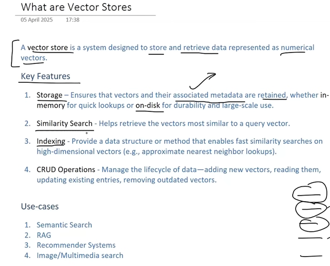
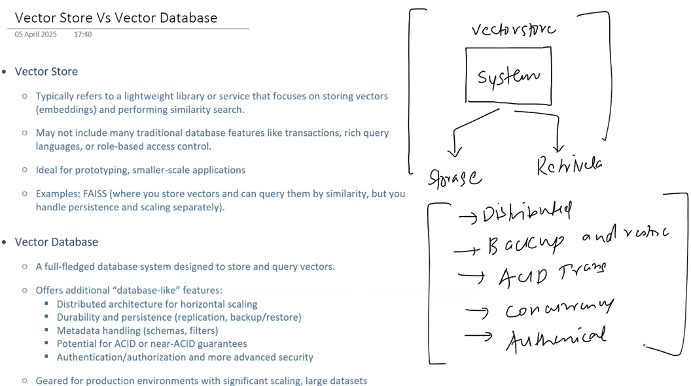
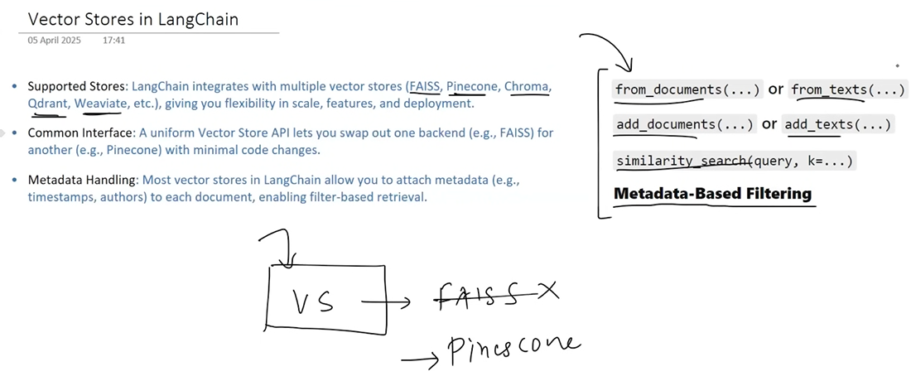
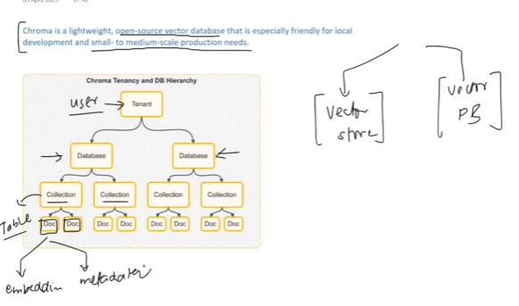

## 📌 What Are Vector Stores?
A vector store is a specialized database that stores high-dimensional vectors (numeric representations of text) and allows fast similarity search.
- In LangChain, vector stores are used to:
- Index documents
- Embed documents (via LLM embeddings)
- Retrieve relevant chunks based on query similarity

## ❓ Why Use Vector Stores in GenAI?
| Challenge                              | Vector Store Solution                                   |
| -------------------------------------- | ------------------------------------------------------- |
| LLMs lack long-term memory             | Store & retrieve relevant context via similarity search |
| Search over raw text is imprecise      | Vectors capture **semantic meaning**, not just keywords |
| Need fast retrieval over large corpora | Optimized for millisecond nearest neighbor lookup       |
| Power RAG (retrieval + generation)     | Supply relevant chunks to LLM prompts                   |

## 🔧 How They Work (End-to-End)
flowchart LR
A[Documents (PDF, CSV, etc)] --> B[Text Splitter]
B --> C[Chunks]
C --> D[Embeddings Model]
D --> E[Vector Store (e.g., Chroma)]
E --> F[Retriever]
F --> G[LLM Input Context]

## 📦 Common Vector Store Backends in LangChain
| Vector Store    | Type             | Description                                            |
| --------------- | ---------------- | ------------------------------------------------------ |
| `Chroma`        | In-memory / disk | Fast, local, open-source store, great for prototyping  |
| `FAISS`         | Local            | Facebook’s fast approximate search library             |
| `Pinecone`      | Cloud            | Scalable vector DB with filtering and metadata support |
| `Weaviate`      | Cloud/local      | Semantic vector DB with rich filtering                 |
| `Qdrant`        | Cloud/local      | High-perf DB with filtering and clustering             |
| `Milvus`        | Cloud/local      | High-scale, for billion+ embeddings                    |
| `Supabase`      | Cloud            | Postgres-based vector search with pgvector             |
| `Elasticsearch` | Cloud/local      | Traditional + vector search                            |

## 🧠 Each Vector Store Supports
| Feature                | Description                                      |
| ---------------------- | ------------------------------------------------ |
| `.add_documents()`     | Store list of `Document` chunks after embedding  |
| `.as_retriever()`      | Convert to retriever for `RetrievalQA`           |
| `.similarity_search()` | Find top-k similar documents based on input text |
| `.delete()`            | Remove vectors                                   |

| Best Practice                | Why Important                                 |
| ---------------------------- | --------------------------------------------- |
| Use good chunking strategy   | Better context in retrieval                   |
| Add metadata (source, page)  | Improve traceability and filtering            |
| Normalize documents          | Clean noisy text before embedding             |
| Use same embedding model     | For both indexing and querying                |
| Test vector distance metrics | Choose cosine or L2 based on backend behavior |

| Function                   | Purpose                          |
| -------------------------- | -------------------------------- |
| `from_documents()`         | Create vector store from docs    |
| `add_documents()`          | Add more docs later              |
| `as_retriever()`           | Use in RetrievalQA chains        |
| `similarity_search(query)` | Get most similar document chunks |

| Criteria      | Pinecone                 | Chroma                   |
| ------------- | ------------------------ | ------------------------ |
| **Best for**  | Production RAG pipelines | Local dev & POCs         |
| **Scale**     | Infinite (cloud)         | Limited to local storage |
| **Privacy**   | Cloud-based              | Local                    |
| **Cost**      | Paid (usage-based)       | Free                     |
| **Setup**     | Cloud + API key          | pip install              |
| **Filtering** | Advanced + fast          | Basic                    |
| **Security**  | Enterprise-grade         | None                     |
